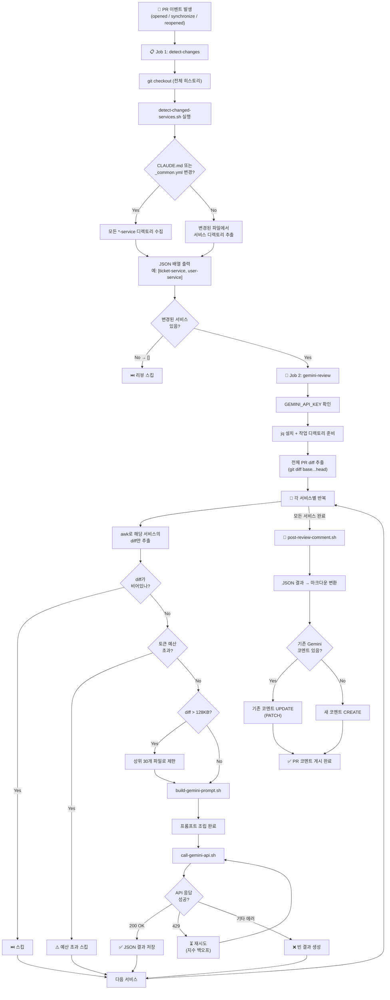
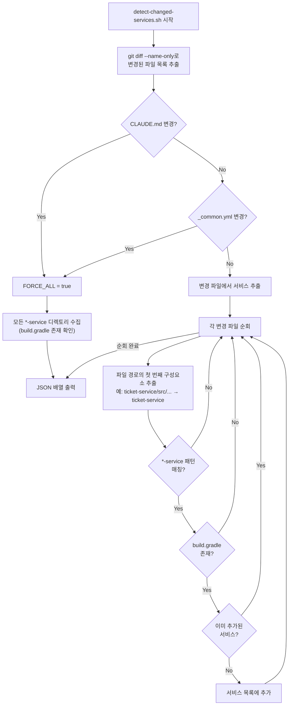
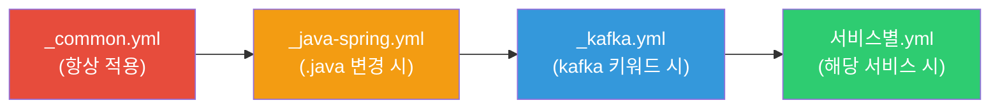
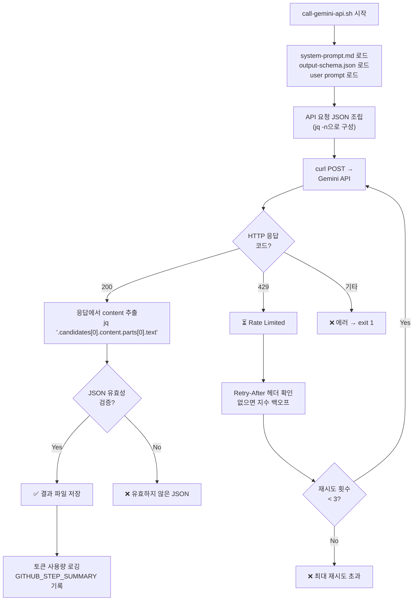

# 🤖 Gemini AI 코드 리뷰 시스템 — 완전 분석 가이드

> **대상:** 주니어 백엔드 개발자
> **프로젝트:** GitHub Actions 기반 AI 자동 코드 리뷰 파이프라인
> **핵심:** PR이 올라오면 Gemini AI가 **CRITICAL 수준의 버그만** 자동으로 찾아서 PR 코멘트로 남겨주는 시스템

---

## 📁 프로젝트 전체 구조

```
.github/
├── prompts/                        ← AI에게 보내는 "지시서"
│   ├── system-prompt.md            ← Gemini에게 주는 역할/규칙 설명
│   └── output-schema.json          ← Gemini 응답의 JSON 형식 정의
│
├── review-rules/                   ← 서비스별 "체크리스트"
│   ├── _common.yml                 ← 모든 서비스에 공통 적용
│   ├── _java-spring.yml            ← Java 파일 변경 시 추가 적용
│   ├── _kafka.yml                  ← Kafka 관련 코드 변경 시 추가 적용
│   ├── creator-service.yml         ← 크리에이터 서비스 전용 규칙
│   ├── gateway-service.yml         ← API 게이트웨이 전용 규칙
│   ├── movie-service.yml           ← 영화 서비스 전용 규칙
│   ├── payment-service.yml         ← 결제 서비스 전용 규칙
│   ├── reivew-service.yml          ← 리뷰 서비스 전용 규칙
│   ├── schedule-service.yml        ← 스케줄 서비스 (빈 스켈레톤)
│   ├── settlement-service.yml      ← 정산 서비스 전용 규칙
│   ├── ticket-service.yml          ← 티켓 서비스 전용 규칙
│   └── user-service.yml            ← 유저 서비스 전용 규칙
│
├── scripts/                        ← 실제 실행되는 Shell 스크립트
│   ├── detect-changed-services.sh  ← 어떤 서비스가 변경됐는지 감지
│   ├── build-gemini-prompt.sh      ← 규칙 + diff를 프롬프트로 조립
│   ├── call-gemini-api.sh          ← Gemini API 호출 + 재시도 처리
│   └── post-review-comment.sh      ← 결과를 PR 코멘트로 게시
│
└── workflows/                      ← GitHub Actions 워크플로우
    ├── pr-review.yml               ← 메인 워크플로우 (전체 오케스트레이션)
    └── build-test-service.yml      ← 재사용 가능한 빌드 워크플로우
```

---

## 🔄 전체 플로우차트 (Mermaid)



---

## 📝 파일별 상세 분석

---

### 1. `workflows/pr-review.yml` — 메인 오케스트레이터

**한 줄 요약:** "PR이 열리면 전체 흐름을 총지휘하는 '감독관'"

#### 언제 실행되나?

```yaml
on:
  pull_request:
    types: [opened, synchronize, reopened]
    branches: [main, develop, 'dev/*']
```

- `opened`: PR을 처음 만들 때
- `synchronize`: PR 브랜치에 새 커밋을 push할 때
- `reopened`: 닫았던 PR을 다시 열 때

이 세 가지 이벤트가 `main`, `develop`, `dev/*` 브랜치를 대상으로 발생하면 실행됩니다.

#### 권한 설정

```yaml
permissions:
  contents: read          # 코드 읽기
  pull-requests: write    # PR에 코멘트 쓰기
  issues: write           # 이슈 API 접근 (코멘트 수정에 필요)
```

**주니어 포인트:** GitHub Actions에서는 최소 권한 원칙(Principle of Least Privilege)을 지켜야 합니다. 필요한 권한만 명시적으로 선언하는 게 좋은 습관입니다.

#### Job 1: `detect-changes`

```yaml
- name: Detect changed *-service directories
  id: detect
  run: |
    SERVICES=$(.github/scripts/detect-changed-services.sh \
      "${{ github.event.pull_request.base.sha }}" \
      "${{ github.sha }}")
```

- `base.sha`: PR의 대상 브랜치(예: main)의 최신 커밋
- `github.sha`: PR 브랜치의 최신 커밋
- 이 두 SHA를 비교해서 "어떤 서비스 폴더가 변경됐는지" 감지합니다.

#### Job 2: `gemini-review`

```yaml
gemini-review:
  needs: detect-changes
  if: needs.detect-changes.outputs.has_changes == 'true'
```

**`needs`**: Job 1이 끝나야 Job 2가 시작됩니다 (의존성).
**`if`**: 변경된 서비스가 있을 때만 실행합니다 (불필요한 API 호출 방지).

##### 토큰 예산 관리 (중요 개념!)

```yaml
env:
  MAX_INPUT_TOKENS_PER_PR: 100000  # PR당 최대 10만 토큰
```

```bash
# 바이트 / 4 ≈ 토큰 (근사 추정)
BUDGET_BYTES=$((MAX_TOKENS * 4))  # = 400,000 bytes = 약 400KB
```

**왜 필요한가?** Gemini API는 토큰 수에 따라 비용이 발생합니다. 모노레포에서 거대한 PR이 올라오면 API 비용이 폭증할 수 있어서, 예산을 정해놓고 초과하면 스킵합니다.

##### 대용량 diff 처리

```bash
# diff가 128KB 초과 → 상위 30개 파일만 유지
if [[ $DIFF_SIZE -gt 131072 ]]; then
  awk '
    /^diff --git / { file_count++; in_block=1 }
    file_count > 30 { next }
    in_block { print }
  ' /tmp/service_diff.txt > /tmp/service_diff_trimmed.txt
fi
```

**awk 설명:**
- `diff --git`으로 시작하는 줄을 만날 때마다 파일 카운트를 증가
- 30개를 넘으면 `next`로 출력을 건너뜀
- 결과: 처음 30개 파일의 diff만 남김

---

### 2. `workflows/build-test-service.yml` — 재사용 빌드 워크플로우

**한 줄 요약:** "서비스 하나를 빌드하는 '공장 설비' — 다른 워크플로우에서 가져다 씀"

```yaml
on:
  workflow_call:    # ← 다른 워크플로우에서 호출할 수 있음
    inputs:
      service:
        required: true
        type: string
    outputs:
      build_status:
        value: ${{ jobs.build.outputs.build_status }}
```

**`workflow_call`이란?** GitHub Actions의 "재사용 가능 워크플로우" 기능입니다. 여러 서비스에서 동일한 빌드 과정을 반복하지 않고, 이 워크플로우를 호출만 하면 됩니다.

#### 빌드 과정

```
1. 코드 체크아웃
2. Java 21 (Temurin) 설정
3. Gradle 캐시 복원 (빌드 속도 향상)
4. ./gradlew build -x test --no-daemon
   └── -x test: 테스트 제외 (컴파일만)
   └── --no-daemon: CI에서는 Gradle 데몬 불필요
5. 실패 시 → 빌드 리포트를 아티팩트로 업로드 (3일간 보관)
```

**주니어 포인트:** `-x test`는 빌드 시간 단축을 위해 테스트를 건너뛰는 옵션입니다. CI에서는 빌드 검증과 테스트를 별도 Job으로 분리하는 것이 일반적입니다.

---

### 3. `scripts/detect-changed-services.sh` — 변경 서비스 감지기

**한 줄 요약:** "PR에서 어떤 마이크로서비스가 수정됐는지 알아내는 '탐정'"

#### 플로우차트



#### 핵심 코드 해설

##### 1) 강제 전체 리뷰 조건

```bash
if echo "$CHANGED_FILES" | grep -qE '^CLAUDE\.md$'; then
  FORCE_ALL=true
fi
if echo "$CHANGED_FILES" | grep -qE '^\.github/review-rules/_common\.yml$'; then
  FORCE_ALL=true
fi
```

**왜?** `CLAUDE.md`는 프로젝트 전체 아키텍처 문서이고, `_common.yml`은 모든 서비스에 적용되는 공통 규칙입니다. 이 파일들이 변경되면 모든 서비스에 영향을 줄 수 있으므로 전체 리뷰를 강제합니다.

##### 2) 서비스 디렉토리 감지 로직

```bash
svc=$(echo "$file" | cut -d'/' -f1)
# "ticket-service/src/main/java/..." → "ticket-service"

if [[ "$svc" == *-service ]] && \        # 패턴 매칭
   [[ -z "${SEEN[$svc]+x}" ]] && \       # 중복 체크 (연관 배열)
   [[ -f "$REPO_ROOT/$svc/build.gradle" ]]; then  # 실제 서비스인지 확인
  SEEN[$svc]=1
  CHANGED_SERVICES+=("$svc")
fi
```

**`declare -A SEEN`**: Bash의 연관 배열(associative array)로 중복을 방지합니다. 같은 서비스의 여러 파일이 변경되어도 한 번만 기록됩니다.

**`build.gradle` 체크**: 단순히 `*-service`로 끝나는 폴더가 아니라, Gradle 빌드 파일이 있는 실제 Java 서비스만 대상으로 합니다.

##### 3) JSON 출력

```bash
printf '%s\n' "${CHANGED_SERVICES[@]}" | jq -R . | jq -sc .
```

**실행 과정:**
```
ticket-service       → jq -R . → "ticket-service"       → jq -sc . → ["ticket-service",
user-service            →         "user-service"          →             "user-service"]
```

- `jq -R .`: 각 줄을 JSON 문자열로 변환
- `jq -sc .`: 모든 입력을 하나의 JSON 배열로 합침

---

### 4. `scripts/build-gemini-prompt.sh` — 프롬프트 조립기

**한 줄 요약:** "서비스별 리뷰 규칙과 코드 변경사항을 XML 구조로 조립하는 '레시피 작성기'"

#### 규칙 적용 계층 (4단계)



| 계층 | 파일 | 적용 조건 | 예시 |
|------|------|-----------|------|
| Common | `_common.yml` | **항상** | 하드코딩 시크릿, 헥사고날 위반 |
| Tech | `_java-spring.yml` | diff에 `.java` 포함 | 트랜잭션 내 외부 호출 |
| Infra | `_kafka.yml` | diff에 kafka/consumer/producer 포함 | 역직렬화 에러, 멱등성 |
| Domain | `{service}.yml` | 해당 서비스 파일 존재 | 서비스별 고유 위험 |

#### YAML 파싱 함수: `extract_rules_as_text()`

```bash
extract_rules_as_text() {
  local file="$1"
  [[ -f "$file" ]] || return 0  # 파일 없으면 조용히 종료

  while IFS= read -r line; do
    # title: 라인을 찾으면
    if [[ "$line" =~ ^[[:space:]]+title:[[:space:]]*(.*) ]]; then
      current_title="${BASH_REMATCH[1]}"
    # description: 라인을 찾으면
    elif [[ "$line" =~ ^[[:space:]]+description:[[:space:]]*(.*) ]]; then
      in_desc=true
      current_desc="${BASH_REMATCH[1]#> }"
    # 들여쓰기 6칸 이상 = description 계속
    elif $in_desc && [[ "$line" =~ ^[[:space:]]{6,}(.*) ]]; then
      current_desc="${current_desc} ${BASH_REMATCH[1]}"
    fi
  done < "$file"
}
```

**왜 `yq`를 안 쓰나?** CI 환경에서 추가 도구 설치를 최소화하기 위해서입니다. 순수 Bash만으로 YAML을 파싱합니다. `BASH_REMATCH`는 정규식 매칭 결과를 담는 Bash 내장 변수입니다.

#### 최종 출력 구조

```xml
<review_request>
  ticket-service에 대한 리뷰 요청. CRITICAL 이슈만 찾아라.
</review_request>

<critical_check_rules>
  - 하드코딩된 시크릿: API 키, JWT 시크릿 등이 소스코드에 포함된 경우...
  - 헥사고날 레이어 경계 위반: domain/이 infrastructure/를 import하는 경우...
  - 트랜잭션 내 외부 호출: @Transactional 안에서 Kafka 발행하는 경우...
  - 티켓 조회 시 비관적 락 누락: AVAILABLE 티켓 조회에 락이 없는 경우...
</critical_check_rules>

<git_diff service="ticket-service">
  (실제 코드 변경 내용)
</git_diff>
```

---

### 5. `scripts/call-gemini-api.sh` — Gemini API 호출기

**한 줄 요약:** "조립된 프롬프트를 Gemini에게 보내고 답변을 받아오는 '배달부'"

#### 플로우차트



#### API 요청 JSON 구조 (jq로 조립)

```bash
REQUEST_JSON=$(jq -n \
  --arg system_prompt "$SYSTEM_PROMPT" \
  --arg user_prompt "$USER_PROMPT" \
  --argjson output_schema "$OUTPUT_SCHEMA" \
  --argjson max_tokens "$MAX_OUTPUT_TOKENS" \
  '{
    "system_instruction": {
      "parts": [{"text": $system_prompt}]       # ← 시스템 프롬프트 (역할 지정)
    },
    "contents": [
      {
        "role": "user",
        "parts": [{"text": $user_prompt}]       # ← 유저 프롬프트 (규칙 + diff)
      }
    ],
    "generationConfig": {
      "temperature": 0.2,                       # ← 낮은 창의성 (일관된 분석)
      "maxOutputTokens": $max_tokens,           # ← 최대 출력 토큰
      "responseMimeType": "application/json",   # ← JSON만 출력하도록 강제
      "responseSchema": $output_schema          # ← JSON 스키마 강제 (Structured Output)
    }
  }')
```

**주니어 포인트:**
- **`temperature: 0.2`**: 0에 가까울수록 결정적(deterministic) 응답. 코드 리뷰는 창의성이 아닌 정확성이 중요하므로 낮게 설정합니다.
- **`responseMimeType: "application/json"`** + **`responseSchema`**: Gemini의 Structured Output 기능을 활용하여 항상 정해진 JSON 형식으로만 응답하게 강제합니다.

#### 재시도 로직 (지수 백오프)

```bash
# 429 (Too Many Requests) 시 재시도
RETRY_AFTER=$(grep -i '^retry-after:' /tmp/gemini_headers.txt | awk '{print $2}')
if [[ -n "$RETRY_AFTER" ]]; then
  WAIT_TIME="$RETRY_AFTER"       # 서버가 알려준 대기시간 사용
else
  WAIT_TIME=$((RETRY_DELAY * (2 ** (attempt - 1))))  # 1초 → 2초 → 4초
fi
```

**지수 백오프(Exponential Backoff)란?** 실패할 때마다 대기 시간을 2배씩 늘리는 전략입니다. 서버가 과부하 상태일 때 짧은 간격으로 재시도하면 상황이 악화되기 때문에, 점점 더 오래 기다려서 서버에 여유를 줍니다.

---

### 6. `scripts/post-review-comment.sh` — PR 코멘트 게시기

**한 줄 요약:** "Gemini의 리뷰 결과를 예쁜 마크다운 표로 변환해서 PR에 게시하는 '리포터'"

#### 핵심 기능

##### 심각도 아이콘 매핑

```bash
severity_icon() {
  case "$1" in
    CRITICAL) echo "🔴" ;;
    HIGH)     echo "🟠" ;;
    MEDIUM)   echo "🟡" ;;
    LOW)      echo "🔵" ;;
    *)        echo "⚪" ;;
  esac
}
```

##### 멱등성(Idempotency) — 코멘트 중복 방지

```bash
MARKER="<!-- gemini-review-id -->"

# 기존 코멘트 찾기
EXISTING_COMMENT_ID=$(gh api \
  "repos/${GITHUB_REPOSITORY}/issues/${PR_NUMBER}/comments" \
  --jq ".[] | select(.body | contains(\"$MARKER\")) | .id" \
  | head -1)

if [[ -n "$EXISTING_COMMENT_ID" ]]; then
  # 있으면 → UPDATE (PATCH)
  gh api --method PATCH \
    "repos/${GITHUB_REPOSITORY}/issues/comments/${EXISTING_COMMENT_ID}" \
    --field body="$(cat "$TEMP_COMMENT")"
else
  # 없으면 → CREATE (POST)
  gh pr comment "$PR_NUMBER" --body-file "$TEMP_COMMENT"
fi
```

**멱등성이란?** 같은 작업을 여러 번 해도 결과가 동일한 성질입니다. PR에 새 커밋을 push할 때마다 리뷰가 다시 돌아가는데, 매번 새 코멘트를 달면 PR이 코멘트로 도배됩니다. 숨겨진 HTML 마커(`<!-- -->`)를 이용해 기존 코멘트를 찾아서 업데이트하는 방식으로 해결합니다.

##### 대용량 코멘트 처리

```bash
COMMENT_LENGTH=$(wc -c < "$TEMP_COMMENT")
if [[ "$COMMENT_LENGTH" -gt 60000 ]]; then
  # GitHub 코멘트 제한: 65,536자
  # 서비스별 finding을 <details> 태그로 접어서 압축
fi
```

GitHub PR 코멘트는 최대 65,536자 제한이 있습니다. 리뷰 대상 서비스가 많으면 이를 초과할 수 있어서, `<details>` HTML 태그로 각 서비스를 접을 수 있게 만듭니다.

---

### 7. `prompts/system-prompt.md` — Gemini 시스템 프롬프트

**한 줄 요약:** "Gemini에게 '너는 시니어 백엔드 코드 리뷰어다'라고 역할을 부여하는 '인사 발령장'"

#### 핵심 지시사항

```
"You are a senior backend code reviewer specializing in
 distributed systems and Spring Boot microservices."
```

Gemini에게 **분산 시스템 + Spring Boot 전문 시니어 리뷰어**라는 페르소나를 부여합니다.

#### CRITICAL의 정의 (매우 엄격)

```
CRITICAL means:
- data corruption risk (데이터 손상 위험)
- race conditions on shared state (공유 상태 경합)
- security vulnerabilities (보안 취약점)
- financial integrity violations (금융 무결성 위반)
```

**왜 CRITICAL만?** LOW/MEDIUM/HIGH 이슈까지 잡으면 노이즈가 너무 많아집니다. 실제로 프로덕션 장애를 일으킬 수 있는 치명적 이슈만 잡아서, 개발자가 AI 리뷰를 신뢰하고 집중할 수 있게 합니다.

#### 응답 규칙

- **한국어**로 응답
- diff에 보이는 코드에 대해서만 판단 (추측 금지)
- 파일 경로와 라인 번호를 구체적으로 명시
- 문제가 없으면 빈 배열 `[]` 반환

---

### 8. `prompts/output-schema.json` — 응답 JSON 스키마

**한 줄 요약:** "Gemini의 응답 형식을 강제하는 '서식 양식'"

```json
{
  "type": "object",
  "required": ["service", "summary", "findings", "praise"],
  "properties": {
    "service": { "type": "string" },
    "summary": { "type": "string" },
    "findings": {
      "type": "array",
      "items": {
        "properties": {
          "severity":    { "enum": ["CRITICAL"] },        // CRITICAL만 허용!
          "category":    { "enum": ["concurrency", "security",
                                    "integrity", "reliability",
                                    "layer-violation"] },
          "file":        { "type": "string" },
          "line_range":  { "type": "string" },
          "title":       { "type": "string" },
          "description": { "type": "string" },
          "suggestion":  { "type": "string" }
        }
      }
    },
    "praise": { "type": "array", "items": { "type": "string" } }
  }
}
```

**주니어 포인트:**
- `"enum": ["CRITICAL"]`: severity에 CRITICAL 외의 값이 들어오면 스키마 검증에서 걸립니다.
- `category`가 5가지로 고정: `concurrency`(동시성), `security`(보안), `integrity`(무결성), `reliability`(안정성), `layer-violation`(계층 위반)

---

## 📋 리뷰 규칙 상세 해설

### 공통 규칙 (`_common.yml`) — 모든 서비스에 적용

| ID | 규칙 | 설명 | 왜 위험한가? |
|-----|------|------|-------------|
| SEC-001 | 하드코딩된 시크릿 | API 키, JWT 시크릿 등이 코드에 직접 작성됨 | GitHub에 코드가 노출되면 시크릿도 같이 노출됨. 환경 변수나 Secrets Manager로 분리 필수 |
| LAYER-001 | 헥사고날 레이어 위반 | `domain/` 패키지가 `infrastructure/`를 import | 도메인 로직이 기술에 의존하면 기술 변경 시 비즈니스 로직까지 수정해야 함 |

### Java/Spring 규칙 (`_java-spring.yml`) — .java 파일 변경 시

| ID | 규칙 | 설명 | 시나리오 |
|-----|------|------|---------|
| TXN-001 | 트랜잭션 내 외부 호출 | `@Transactional` 안에서 Kafka/HTTP 호출 | DB는 롤백되지만 이미 보낸 Kafka 메시지는 취소 불가 → 데이터 불일치 |

### Kafka 규칙 (`_kafka.yml`) — Kafka 관련 코드 변경 시

| ID | 규칙 | 설명 | 시나리오 |
|-----|------|------|---------|
| KFK-001 | 역직렬화 에러 미처리 | try-catch 없이 역직렬화 | 잘못된 메시지 1개가 consumer 전체를 멈춤 (Poison Pill) |
| KFK-002 | 멱등성 가드 누락 | 중복 메시지 방지 없음 | Kafka 리밸런싱 시 같은 메시지 2번 처리 → 잔액 2번 차감 |
| KFK-003 | KafkaMessageUtil 미사용 | 직접 ObjectMapper 사용 | 에러 처리 방식 불일치 → 메시지 형식 깨짐 |

### 서비스별 규칙 요약

| 서비스 | ID | 핵심 위험 |
|--------|-----|-----------|
| **gateway** | GW-001 | JWT 화이트리스트가 너무 넓으면 인증 우회 |
| **gateway** | GW-002 | X-User-Id 헤더를 제거 안 하면 사용자 위장 가능 |
| **creator** | CRT-001 | JWT 시크릿 하드코딩 |
| **creator** | CRT-002 | 패스워드 평문 저장 → DB 유출 시 즉시 계정 탈취 |
| **payment** | PAY-001 | 결제 멱등성 키 없음 → 네트워크 재시도로 이중 결제 |
| **payment** | PAY-002 | 정수 나눗셈 → 환불 금액 오차 |
| **payment** | PAY-003 | 환불 Race Condition → 초과 환불 |
| **ticket** | TKT-001 | 비관적 락 없음 → 같은 좌석 중복 예약 |
| **movie** | MOV-001 | 좌석 수 동시성 미보호 → 초과 예약 |
| **user** | USR-001 | JWT 시크릿 하드코딩 |
| **user** | USR-002 | 쿠키 잔액 경합 → 잔액 오염 |
| **settlement** | SET-001 | 복식부기 미준수 → 감사 추적 불가 |
| **settlement** | SET-002 | 음수 잔액 허용 → 정산 계산 오류 |
| **reivew** | RVW-001 | flag 직접 변경 → 중복 리뷰 방지 우회 |
| **schedule** | — | (아직 규칙 없음, 스켈레톤 상태) |

---

## 🎯 핵심 설계 원칙 정리

### 1. CRITICAL-Only 전략
노이즈를 줄이고 신호를 높입니다. 개발자가 "또 AI가 쓸데없는 거 잡았네"라고 무시하지 않도록, 정말 위험한 것만 보고합니다.

### 2. 계층적 규칙 적용 (4-Tier)
공통 → 기술 → 인프라 → 도메인으로 필요한 규칙만 점진적으로 적용합니다. 결제 서비스의 diff에 Kafka 코드가 없으면 Kafka 규칙을 굳이 보내지 않아서 토큰을 절약합니다.

### 3. 비용 제어
토큰 예산, 대용량 diff 트리밍, 서비스별 예산 분배로 API 비용 폭증을 방지합니다.

### 4. 멱등성
PR 코멘트를 HTML 마커로 추적하여 중복 코멘트 없이 항상 업데이트합니다.

### 5. 장애 허용 (Fault Tolerance)
한 서비스의 리뷰가 실패해도 나머지는 계속 진행됩니다. 빈 결과를 생성해서 워크플로우 전체가 중단되지 않습니다.

### 6. 모노레포 최적화
서비스별 diff 추출, 공유 파일 변경 시 전체 리뷰, Gradle 기반 서비스 감지 등 모노레포 환경에 최적화되어 있습니다.

---

## 🔗 전체 데이터 흐름 요약

```
PR 이벤트 발생
    │
    ▼
detect-changed-services.sh ──→ ["ticket-service", "payment-service"]
    │
    ▼ (서비스별 반복)
    │
    ├─ awk로 서비스 diff 추출
    │
    ├─ build-gemini-prompt.sh
    │   ├─ _common.yml 규칙 로드
    │   ├─ _java-spring.yml 규칙 (조건부)
    │   ├─ _kafka.yml 규칙 (조건부)
    │   ├─ ticket-service.yml 규칙 로드
    │   └─ XML 구조로 프롬프트 조립
    │
    ├─ call-gemini-api.sh
    │   ├─ system-prompt.md + user prompt → Gemini API
    │   ├─ 429 에러 시 지수 백오프 재시도
    │   └─ JSON 결과 추출 + 검증
    │
    └─ 결과: {service, summary, findings[], praise[]}
           │
           ▼
    post-review-comment.sh
    ├─ 모든 서비스 결과를 마크다운 테이블로 변환
    ├─ 기존 코멘트가 있으면 UPDATE, 없으면 CREATE
    └─ PR 코멘트로 게시 완료 ✅
```
