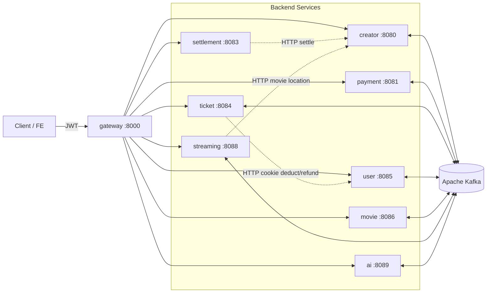
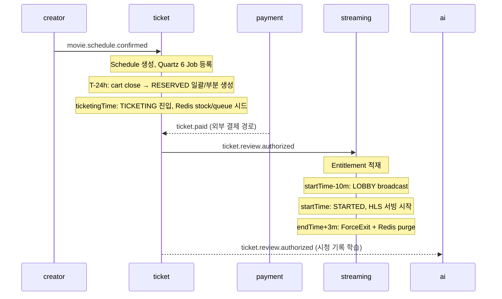
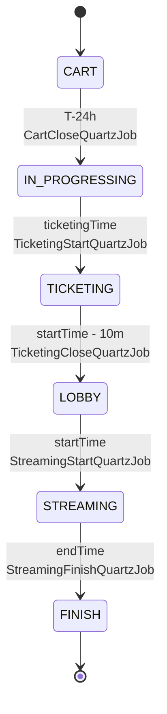

<div align="center">

# CineStream

### 티켓팅 + 라이브 스트리밍 통합 OTT 플랫폼

영화 티켓을 사고, 약속된 시각에 함께 라이브로 시청하는 서비스를 9개의 Spring Boot 마이크로서비스로 풀어낸 백엔드 모노레포

<br/>


</div>

---

## Overview

**CineStream** 은 일반 OTT 의 VOD 모델이 아니라 *공연 티켓팅 + 정해진 시각의 라이브 송출* 을 결합한 서비스다. 사용자는 한정된 좌석을 두고 결제하고, 약속된 시각에 다른 관객들과 같은 화면을 본다.

이 형태가 동시에 요구하는 4가지를 백엔드에서 풀어낸다.

- **선착순 티켓팅** — 한정 좌석에 동시 접속하는 사용자를 Redis 기반 대기열·재고로 처리
- **결제·환불 보상 트랜잭션** — DB · Redis · 외부 HTTP(Toss / user-service) 사이의 일관성
- **라이브 HLS 송출** — 단일 sessionToken 으로 HLS 와 STOMP 채팅을 동시 검증, `endTime+3m` 자동 kick
- **개인화 추천** — 시청·좋아요 이력 기반 K-Means + ε-greedy + LLM Re-ranking 일일 배치

9개 서비스 · Hexagonal Architecture · `@TransactionalEventListener(AFTER_COMMIT)` 기반 이벤트 일관성으로 구현되어 있다.

---

## Service Map

| Service | Port | 책임 | Maintainer | Docs |
|---|---|---|---|---|
| **gateway** | 8000 | JWT 검증 · 라우팅 · `X-User-Id` / `X-Creator-Id` 주입 | [@leeejunu](https://github.com/leeejunu) | [README](gateway-service/README.md) |
| **creator** | 8080 | 크리에이터 관리 · 영화/스케줄 등록 · HLS 산출물 생성 (ffmpeg) | [@jeongbeomgyu](https://github.com/jeongbeomgyu) | [README](creator-service/README.md) |
| **payment** | 8081 | Toss Payments 결제 · 결제 이벤트 발행 | [@y0000h](https://github.com/y0000h) | [README](payment-service/README.md) |
| **settlement** | 8083 | 크리에이터 정산 집계 · creator 서비스로 결과 전달 | [@jeongbeomgyu](https://github.com/jeongbeomgyu) | [README](settlement-service/README.md) |
| **ticket** | 8084 | 티켓 라이프사이클 · 대기열/재고 · 결제 보상 · 일일 배치 | [@corinB](https://github.com/corinB) | [README](ticket-service/README.md) |
| **user** | 8085 | 유저 계정 · 쿠키 지갑 · OAuth · MinIO 프로필 이미지 | [@leeejunu](https://github.com/leeejunu) | [README](user-service/README.md) |
| **movie** | 8086 | 영화 카탈로그 · Elasticsearch nori 검색 · 좋아요 · 리뷰 | [@JunHeeCh](https://github.com/JunHeeCh) [@jeongbeomgyu](https://github.com/jeongbeomgyu) [@y0000h](https://github.com/y0000h) | [README](movie-service/README.md) |
| **streaming** | 8088 | HLS 송출 · WebSocket 채팅 · 동시 시청자 · sessionToken | [@corinB](https://github.com/corinB) | [README](streaming-service/README.md) |
| **ai** | 8089 | 개인화 추천 · OpenAI 임베딩 · K-Means · LLM Re-ranking | [@JunHeeCh](https://github.com/JunHeeCh) | [README](ai-service/README.md) |

각 서비스는 자기 도메인의 어려움을 다른 모양으로 풀고 있다 — 게이트웨이의 Reactive 인증, 크리에이터의 ffmpeg HLS 산출, 결제의 Outbox 패턴, 정산의 멱등 배치, 티켓의 보상 트랜잭션, 유저의 쿠키 지갑 일관성, 무비의 nori 검색, 스트리밍의 sessionToken·강제 종료, AI 의 K-Means + LLM 재랭킹. 자세한 설계는 각 모듈 README 참조.

---

## Architecture

### 1. 서비스 의존성



게이트웨이만 외부에 노출되고, 나머지 서비스는 내부망에서 HTTP / Kafka 로 통신한다.

### 2. 핵심 이벤트 흐름



### 3. Hexagonal Architecture (모든 서비스 공통)

```
com.example.{service}/
├── domain/         ← Entity, Enum, repository port (no framework deps)
├── application/    ← UseCase, Service, DTO, output ports
│                     (CachePort, EventPublisherPort, UserPort, …)
├── infrastructure/ ← Adapter (JPA, Redis, Kafka, Quartz, RestClient, Batch)
└── presentation/   ← Controller, GlobalExceptionHandler
```

Repository 는 **3단 계층**으로 분리되어 있다.

```
domain.repository.XxxRepository       (port)
  ↑ implemented by
infrastructure.persistence.impl.XxxRepositoryImpl
  ↑ delegates to
infrastructure.persistence.XxxJpaRepository  (Spring Data JPA)
```

### 4. Event-driven Consistency

서비스는 `@Transactional` 메서드 안에서 Spring `ApplicationEvent` 를 발행한다. `@TransactionalEventListener(phase = AFTER_COMMIT)` 핸들러가 그 이벤트를 받아 Kafka publish · Redis write · HTTP call 을 수행한다.

> DB 커밋 후에만 부수효과가 일어나므로, DB 롤백 시 가짜 Kafka 메시지나 stale Redis state 가 생기지 않는다. HTTP 호출이 먼저 성공한 뒤 DB 가 롤백되는 케이스는 `CookieCompensationHelper` 로 환불 보상 콜백을 등록한다 — 자세한 패턴은 [ticket-service/README.md](ticket-service/README.md) 참조.

---

## Ticket Lifecycle

티켓팅 도메인은 여러 서비스가 함께 만드는 흐름의 줄거리다. 한 스케줄은 다음 6단계를 거치며, 각 전이는 ticket-service 의 Quartz Job 이 트리거하고 streaming / ai 서비스가 Kafka 로 이어 받는다.



- **CART** — 사용자가 장바구니에 담는 단계. Redis `cart:count:schedule:{id}` 카운터로 수요를 추정한다.
- **IN_PROGRESSING / TICKETING** — 수요 ≤ 좌석이면 일괄 RESERVED 생성, 초과면 선착순 부분 예약. TICKETING 진입 시 Redis `stock` / `queue` / `paying` 키를 시드.
- **LOBBY** — 결제·큐 매수가 차단되고 채팅 대기방이 열린다. 동일 시각에 streaming 의 `LobbyOpenJob` 도 발화한다.
- **STREAMING / FINISH** — HLS 송출 시작·종료. `endTime+3m` 에 streaming 이 모든 세션을 강제 종료.

대기열 드레인, 환불 → 재고 복구, HTTP+DB 보상 트랜잭션 등 디테일은 → **[ticket-service/README.md](ticket-service/README.md)**

---

## Tech Stack

| 분류 | 기술 |
|---|---|
| **Language / Runtime** | Java 21, Spring Boot 4.0.4, Spring Cloud Gateway |
| **Persistence** | PostgreSQL 18, JPA / Hibernate, QueryDSL, pgvector (ai), H2 (test) |
| **Cache / Queue** | Redis 7 (counters · sorted set queue · session cache) |
| **Messaging** | Apache Kafka (KRaft), `@TransactionalEventListener(AFTER_COMMIT)` |
| **Search** | Elasticsearch 8 + nori (Korean tokenizer) |
| **Object Storage** | MinIO (S3-compatible, 프로필 이미지) |
| **Streaming** | HLS (creator 가 ffmpeg 으로 산출, streaming 이 서빙), STOMP / WebSocket |
| **Auth / Token** | JWT (gateway) + JJWT HS256 sessionToken (streaming) |
| **Scheduling** | Quartz (clustered in prod), Spring Batch |
| **AI** | OpenAI `text-embedding-3-small`, `gpt-4o-mini`, K-Means, ε-greedy |
| **DevOps** | Docker · docker-compose, GitHub Actions CI/CD, EC2 profile-based deploy, Helm chart |

---

## Local Development

### 1. 인프라 구동

```bash
cd local/db            && docker-compose up -d   # PostgreSQL 18 + pgAdmin (:18080)
cd local/redis         && docker-compose up -d   # Redis 7
cd local/mnio          && docker-compose up -d   # MinIO (user-service)
cd local/elasticsearch && docker-compose up -d   # ES + nori (movie-service)
```

DB 가 뜨면 루트의 `init.sql` 을 실행해 7개 서비스 DB (`creator_db`, `payment_db`, `settlement_db`, `ticket_db`, `user_db`, `ai_db`, `streaming_db`) 와 `vector` 확장(ai_db)을 만든다.

### 2. 서비스 실행

각 서비스는 독립 Gradle 프로젝트다.

```bash
cd ticket-service && ./gradlew bootRun     # 8084
cd streaming-service && ./gradlew bootRun  # 8088
# 필요한 서비스만 띄우면 된다
```

dev 프로파일은 localhost 인프라를 가정하며, Swagger 는 `http://localhost:{port}/swagger-ui.html` 에서 확인할 수 있다.

자세한 가이드는 → [docs/env-guide.md](docs/env-guide.md), [docs/DEPLOYMENT.md](docs/DEPLOYMENT.md), 시연 모드는 [docs/DEMO.md](docs/DEMO.md).

---

## Profiles

| 항목 | dev | prod |
|---|---|---|
| 설정 소스 | `application-dev.yaml`, localhost | env vars (`DB_HOST`, `REDIS_HOST`, `KAFKA_BOOTSTRAP_SERVERS`, …) |
| `ddl-auto` | `create` | `${DDL_AUTO}` |
| Logging | DEBUG | WARN |
| Swagger UI | on (`/swagger-ui.html`) | off |
| Quartz | non-clustered, 5 threads | clustered, 10 threads |

---

## Project Structure

```
beadv5_5_3M_BE/
├── gateway-service/        ← :8000  Spring Cloud Gateway, JWT 검증, 헤더 주입
├── creator-service/        ← :8080  영화·스케줄 등록, ffmpeg HLS 산출
├── payment-service/        ← :8081  Toss Payments, Outbox 패턴
├── settlement-service/     ← :8083  지갑·정산·DLQ + Spring Batch
├── ticket-service/         ← :8084  티켓 라이프사이클·대기열·보상 트랜잭션
├── user-service/           ← :8085  계정·쿠키 지갑·OAuth·MinIO
├── movie-service/          ← :8086  카탈로그·Elasticsearch nori·리뷰
├── streaming-service/      ← :8088  HLS·WS·sessionToken·ForceExit
├── ai-service/             ← :8089  추천·pgvector·LLM Re-ranking
├── local/                  ← infra docker-compose (db, redis, mnio, es)
├── docs/                   ← 배포·CI/CD·env·시연 가이드
├── k8s/                    ← Helm chart (운영 배포용)
├── .github/workflows/      ← CI / CD / PR Review
└── init.sql                ← 7개 서비스 DB 생성 스크립트
```

---

## Team

| 이름 | GitHub | 담당 서비스 | 주요 기여 |
|---|---|---|---|
| 백종현 | [@corinB](https://github.com/corinB) | ticket, streaming | 티켓 라이프사이클·대기열·환불 보상 / sessionToken·HLS·STOMP·ForceExit |
| 이준우 | [@leeejunu](https://github.com/leeejunu) | gateway, user | 게이트웨이 JWT 검증·라우팅 / 유저 계정·쿠키·MinIO 프로필 |
| 정범규 | [@jeongbeomgyu](https://github.com/jeongbeomgyu) | creator, settlement, movie | 영화·스케줄 등록·ffmpeg HLS / 크리에이터 정산 / 카탈로그 |
| 김영환 | [@y0000h](https://github.com/y0000h) | payment, movie | Toss Payments 연동·결제 이벤트 발행 / 카탈로그 |
| 조준희 | [@JunHeeCh](https://github.com/JunHeeCh) | ai, movie | 추천 배치·임베딩·LLM Re-ranking / 카탈로그 |

> 멘션이 필요한 경우 표의 GitHub 핸들을 그대로 복사해 사용하면 된다 (PR 댓글 / 이슈 등).

---

## Documentation

- 배포·운영 — [docs/DEPLOYMENT.md](docs/DEPLOYMENT.md), [docs/cicd-pipeline.md](docs/cicd-pipeline.md), [docs/env-guide.md](docs/env-guide.md), [docs/k8s-team-summary.md](docs/k8s-team-summary.md)
- 시연 모드 — [docs/DEMO.md](docs/DEMO.md)
- AI PR 리뷰 — [REVIEW-SYSTEM.md](REVIEW-SYSTEM.md), [.github/workflows/pr-review.yml](.github/workflows/pr-review.yml)

---

<details>
<summary><b>Contributing — 브랜치 전략 & 커밋 컨벤션</b></summary>

### 브랜치 구조

```
main                        ← 운영 배포 (PR-only)
develop                     ← 전체 통합 / 서비스 간 연동 테스트
dev/{service}               ← 서비스별 CI/CD 트리거 (예: dev/ticket)
feature/{service}/{기능명}  ← 기능 개발
fix/{service}/{버그명}      ← 버그 수정
chore/{service}/{작업명}    ← 설정·유지보수
```

### 브랜치 흐름

```
dev/{service}        →  feature/{service}/{기능}      ← 분기
feature/{service}/{기능} → dev/{service}              ← PR
dev/{service}        →  CI/CD                        ← 서비스별 독립 배포
dev/{service}        →  develop                      ← 통합 테스트
develop              →  main                         ← 릴리스
```

브랜치는 항상 최신 상태에서 분기한다.

```bash
git checkout dev/{service}
git pull
git checkout -b feature/{service}/{기능명}
```

### 커밋 컨벤션

`type(scope): message` 형식. type 은 `feat` / `fix` / `refactor` / `docs` / `style` / `test` / `chore` 중 하나, scope 는 서비스명.

```
feat(user): 이메일 로그인 기능 추가
fix(payment): 결제 실패 시 재시도 로직 추가
refactor(ticket): 큐 드레인 쿼리 성능 개선
chore(gateway): docker 설정 변경
```

규칙:
- 하나의 커밋은 하나의 작업만 포함
- 메시지만 보고 작업 내용을 이해할 수 있어야 함 (`수정`, `테스트` 같은 의미 없는 메시지 금지)

### Pull Request 규칙

- `feature/*` → `dev/{service}`
- `dev/{service}` → `develop`
- `develop` → `main`

</details>
