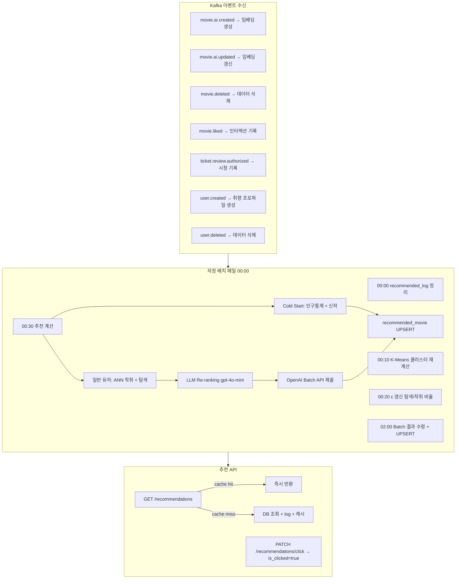

# ai-service

> 개인화 추천 — OpenAI 임베딩 + pgvector ANN + K-Means + ε-greedy + LLM Re-ranking
>
> **Maintainer:** [@JunHeeCh](https://github.com/JunHeeCh)

CineStream 의 추천 엔진. 사용자의 시청·좋아요 이력을 학습해 매일 자정 배치로 개인화 추천을 생성한다. **추천 계산만 전담** 하고, 유저 계정 / 영화 원본 / 시청 기록은 각 서비스가 소유한 채로 Kafka 이벤트로 동기화 받는다. cold-start, ANN 벡터 검색, ε-greedy 탐색·착취, LLM 재랭킹, OpenAI Batch API 비동기 처리 등 추천 시스템의 정석 파이프라인을 그대로 구현했다. 상위 [루트 README](../README.md) 도 함께 참조.

---

## Responsibilities

- 영화 임베딩 생성 (`text-embedding-3-small`, 1536 dim, pgvector + hibernate-vector)
- K-Means 클러스터링으로 유저 취향 벡터 갱신
- ε-greedy 탐색·착취 비율 동적 조정
- ANN 벡터 검색(착취) + 신작·저노출 후보(탐색)
- LLM Re-ranking (`gpt-4o-mini`) 으로 상위 후보 재정렬
- 추천 결과 캐싱 (Redis, TTL = 다음 자정까지)
- 추천 노출·클릭 로깅 (`recommended_log`)

---

## Tech Stack


---

## 데이터 소유권

이 서비스는 **추천 계산만 전담**한다. 다른 서비스의 데이터는 Kafka 이벤트로 동기화 받는다.

| 데이터 | 소유 서비스 | AI 수신 토픽 |
|---|---|---|
| 유저 계정 | user-service | `user.created` / `user.deleted` |
| 영화 메타데이터 | movie-service / creator-service | `movie.ai.created` / `movie.ai.updated` / `movie.deleted` / `movie.liked` |
| 시청 기록 | ticket-service | `ticket.review.authorized` |

추천 결과는 `[{logId, movieId}]` 만 반환한다. 제목·이미지 등 표시 정보는 movie-service 가 책임진다.

---

## Architecture

```
com.example.aiservice/
├── domain/                  ← User, Movie, Interaction, Recommendation, RecommendedLog
├── application/
│   ├── usecase/             ← Recommend, Click, Batch (cleanup, kmeans, epsilon, calculate)
│   ├── service/             ← BatchOrchestrator, KMeansService, EpsilonService,
│                              CalculateService, ColdStartService, ReRankService
│   └── port/                ← OpenAiEmbeddingPort, OpenAiChatPort, CachePort
├── infrastructure/
│   ├── persistence/         ← *JpaRepository + Adapter, pgvector ANN 쿼리
│   ├── openai/              ← OpenAI 임베딩 / chat / batch API 클라이언트
│   ├── kafka/consumer/      ← MovieEventConsumer, TicketEventConsumer, UserEventConsumer
│   └── redis/               ← 추천 결과 캐시
└── presentation/            ← RecommendationController, BatchController (dev)
```

---

## 핵심 파이프라인



핵심 알고리즘 결정:

- **Cold start 판단** — 시청·좋아요 가중치 합계가 임계치 미만이면 cold start. 인구통계·신작·저노출 후보로 채운다.
- **K-Means + ε-greedy** — 매일 윈도(`window-size=100`) 안의 최근 인터랙션으로 K-Means 재계산. ε 은 매일 조정해 신규 영화 노출(탐색) 과 취향 매칭(착취) 의 균형을 맞춘다.
- **ANN 벡터 검색** — pgvector 의 IVFFlat / HNSW 인덱스로 유저 취향 벡터 ↔ 영화 임베딩 cosine 검색. ORM 레이어는 `hibernate-vector` 를 사용한다.
- **LLM Re-ranking** — 상위 N 후보를 `gpt-4o-mini` 로 재정렬. OpenAI Batch API 를 사용해 비용을 절감하고, 02:00 에 결과를 수령.

---

## Kafka Topics (모두 inbound)

| Topic | Source | 용도 |
|---|---|---|
| `movie.ai.created` | creator | 영화 임베딩 생성 + 통계 초기화 |
| `movie.ai.updated` | creator | 임베딩 / 공개 상태 갱신 |
| `movie.deleted` | creator | 전체 데이터 삭제 |
| `movie.liked` | movie | 좋아요 인터랙션 기록 |
| `ticket.review.authorized` | ticket | 시청 기록 |
| `user.created` | user | 취향 프로필 생성 |
| `user.deleted` | user | 유저 데이터 전체 삭제 |

이 서비스는 **내부 서비스 간 HTTP outbound 없음** — 외부 호출은 OpenAI API 한정이며, 내부 서비스 간 통신은 Kafka 단방향이다.

---

## API

| 메서드 | 경로 | 설명 |
|---|---|---|
| `GET` | `/api/recommendations` | 유저 추천 목록 (Redis 캐시 우선) |
| `PATCH` | `/api/recommendations/click` | 추천 클릭 이벤트 기록 |

**공통 헤더**

| 헤더 | 타입 | 필수 | 설명 |
|---|---|---|---|
| `X-User-Id` | UUID | ✅ | 게이트웨이가 주입하는 유저 식별자 |

**GET `/api/recommendations` Response**

```json
[
  { "logId": 1, "movieId": 42 },
  { "logId": 2, "movieId": 17 }
]
```

**PATCH `/api/recommendations/click` Request Body**

```json
{ "logId": 1 }
```

dev 프로파일에서만 노출되는 배치 수동 트리거:

| 메서드 | 경로 | 설명 |
|---|---|---|
| `POST` | `/internal/batch/cleanup` | recommended_log 정리 |
| `POST` | `/internal/batch/epsilon` | ε 갱신 |
| `POST` | `/internal/batch/kmeans` | K-Means 재계산 |
| `POST` | `/internal/batch/calculate` | 후보 선정 + OpenAI Batch API 제출 |
| `POST` | `/internal/batch/submit-daily` | cleanup → epsilon → kmeans → calculate 순차 |
| `POST` | `/internal/batch/receive` | OpenAI Batch 결과 수령 (02:00 스케줄러와 동일) |

epsilon · kmeans · calculate 는 body 에 UUID 목록을 받으며, 비어 있으면 어제 활성 유저를 자동 조회한다.

자세한 스펙: Swagger UI `http://localhost:8089/swagger-ui/index.html`.

---

## Dependencies

| 종류 | 대상 |
|---|---|
| External | OpenAI API (`text-embedding-3-small`, `gpt-4o-mini`, Batch API) |
| Kafka inbound | 위 표 7종 |
| Infra | PostgreSQL 18 + pgvector (hibernate-vector), Redis 7, Kafka |

---

## Run

### 사전 요구사항

- Java 21
- PostgreSQL 18 (pgvector 확장 설치 필요)
- Redis 7
- Kafka 브로커
- OpenAI API Key

### 1. Redis 실행

```bash
docker-compose up -d
```

`docker-compose.yaml` 은 Redis 만 포함. Kafka 와 PostgreSQL 은 별도 설정 필요.

### 2. PostgreSQL 설정

```sql
CREATE DATABASE ai_db;
\c ai_db
CREATE EXTENSION vector;
```

### 3. 환경 변수

```bash
export OPENAI_API_KEY=sk-...
```

### 4. 서버 실행

```bash
./gradlew bootRun                     # dev profile, port 8089
```

### 주요 설정 (application-dev.yaml)

| 항목 | 기본값 | 설명 |
|---|---|---|
| `OPENAI_API_KEY` | (필수) | OpenAI 인증 키 |
| `openai.summary-model` | `gpt-4o-mini` | 영화 요약 |
| `openai.reranking-model` | `gpt-4o-mini` | LLM 재랭킹 |
| `openai.embedding-model` | `text-embedding-3-small` | 임베딩 |
| `openai.embedding-dimensions` | `1536` | 벡터 차원 |
| `batch.base-epsilon` | `0.1` | 탐색 기본 비율 |
| `batch.kmeans.window-size` | `100` | K-Means 입력 인터랙션 수 |
| `batch.kmeans.k-max` | `5` | K-Means 최대 클러스터 수 |
| `batch.kmeans.cold-start-threshold` | `15.0` | Cold start 판단 가중치 임계값 |

---

## 추가 자료

| 문서 | 내용 |
|---|---|
| [docs/architecture.md](docs/architecture.md) | 서비스 아키텍처, DB 스키마, Kafka 처리 |
| [docs/recommendation-algorithm.md](docs/recommendation-algorithm.md) | 추천 알고리즘 (K-Means, ε-greedy, LLM Re-ranking) |
| [docs/embedding-pipeline.md](docs/embedding-pipeline.md) | 임베딩 파이프라인 설계 / 모델 선택 근거 |
| [docs/troubleshooting.md](docs/troubleshooting.md) | 개발 중 발생한 버그 및 해결 |