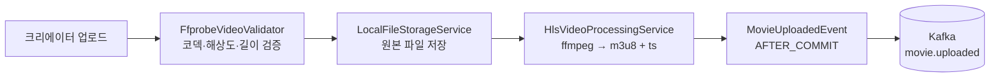

# creator-service

> 크리에이터 계정 · 영화 카탈로그 등록 · 라이브 스케줄 발행 · ffmpeg 으로 HLS 산출물 생성을 담당
>
> **Maintainer:** [@jeongbeomgyu](https://github.com/jeongbeomgyu)

CineStream 의 콘텐츠 공급자(크리에이터) 입장에서 가장 많은 작업이 일어나는 서비스. 영화 메타데이터, 카테고리, 스케줄, 그리고 **실제 동영상 파일을 HLS 매니페스트·세그먼트로 변환**하는 미디어 파이프라인까지 모두 책임진다. 다른 서비스 (ticket / streaming / movie / ai) 가 소비할 도메인 이벤트의 **시작점** 역할을 한다. 상위 [루트 README](../README.md) 도 함께 참조.

---

## Responsibilities

- 크리에이터 회원가입 / 로그인 / JWT 발급 / 페이아웃 계좌 관리
- 영화 등록 · 수정 · 공개 상태 변경 · 삭제
- 카테고리 관리, 스케줄 등록 · 확정 (`ScheduleConfirmedEvent` 발행)
- **HLS 미디어 파이프라인** — ffprobe 검증 → ffmpeg 트랜스코딩 → m3u8 / ts 산출물 저장
- streaming-service 가 호출하는 `/internal/movies/{id}/location` 응답 (HLS 베이스 경로)
- AI 추천 학습용 이벤트 (`movie.ai.created`, `movie.ai.updated`, `movie.deleted`, `movie.visibility.changed`) 발행

---

## Tech Stack


---

## Architecture (Hexagonal)

```
com.example.creatorservice/
├── domain/
│   ├── model/                 ← Creator, Movie, Schedule, Category
│   └── repository/            ← CreatorRepository, MovieRepository,
│                                 ScheduleRepository, CategoryRepository
├── application/
│   ├── usecase/               ← CreatorUseCase, MovieInternalUseCase,
│   │                            MovieUploadUseCase, ScheduleManageUseCase, …
│   ├── service/               ← CreatorService, MovieUploadService,
│   │                            ScheduleManageService, ScheduleBatchService, …
│   └── exception/             ← CreatorNotFound, ScheduleException, MovieException, …
├── infrastructure/
│   ├── persistence/           ← *JpaRepository + *RepositoryAdapter
│   ├── storage/               ← FileStorageService, LocalFileStorageService,
│   │                            FfprobeVideoValidator, HlsVideoProcessingService,
│   │                            LocalVideoProcessingService
│   ├── kafka/
│   │   ├── CreatorEventPublisher, MovieEventPublisher
│   │   ├── dto/               ← *Message records
│   │   ├── event/             ← Spring ApplicationEvent records
│   │   └── listener/          ← MovieAiEventListener (AFTER_COMMIT 핸들러)
├── presentation/              ← CreatorController, MovieController,
│                                 ScheduleController, CategoryController,
│                                 FileController, *InternalController
└── config/                    ← OpenApiConfig, RedisConfig
```

### Repository 3단 패턴 + 이벤트 기반

다른 서비스와 동일하게 `Repository(port) ← RepositoryAdapter ← JpaRepository` 3단을 따른다. Kafka publish 는 `@Transactional` 안에서 `MovieAiCreatedEvent` 같은 ApplicationEvent 를 발행하고, `MovieAiEventListener` 가 `@TransactionalEventListener(AFTER_COMMIT)` 으로 받아 Kafka 에 전송한다.

---

## HLS 미디어 파이프라인



- **FfprobeVideoValidator** 가 업로드된 파일의 메타데이터를 ffprobe 로 검증 (지원 코덱·해상도·길이).
- **HlsVideoProcessingService** 가 ffmpeg 으로 HLS 산출물(m3u8 + 세그먼트) 을 생성. 운영 환경에서는 동일 EC2 / k8s 노드의 디스크에 저장되어 streaming-service 가 직접 읽는다.
- 영화 영구 삭제 시 `MovieFileDeleteEvent` 가 발화되어 산출물도 함께 정리된다.

streaming-service 는 세션 발급 시 `GET /internal/movies/{id}/location` 으로 이 베이스 경로를 받아 매니페스트 서빙에 사용한다.

---

## Kafka Topics (publish 위주)

| Topic | Direction | Purpose |
|---|---|---|
| `creator.created` | outbound | 크리에이터 회원가입 (settlement 가 지갑 생성) |
| `movie.ai.created` | outbound | AI 학습용 영화 메타데이터 (임베딩 생성 트리거) |
| `movie.ai.updated` | outbound | AI 학습용 메타데이터 변경 |
| `movie.updated` | outbound | 일반 메타데이터 변경 (movie-service 카탈로그 갱신) |
| `movie.deleted` | outbound | 영화 영구 삭제 (전 서비스 동기화) |
| `movie.visibility.changed` | outbound | 공개 상태 변경 |
| `movie.uploaded` | outbound | HLS 산출물 생성 완료 |
| `movie.schedule.confirmed` | outbound | 스케줄 확정 (ticket / streaming 진입점) |

---

## Dependencies

| 종류 | 대상 |
|---|---|
| HTTP inbound (internal) | streaming-service — `GET /internal/movies/{id}/location` |
| Kafka outbound | 위 표 8종 |
| Infra | PostgreSQL `creator_db`, Redis 7, Kafka, ffmpeg / ffprobe (시스템 바이너리) |

---

## Run

```bash
./gradlew bootRun                     # dev profile, port 8080
SPRING_PROFILES_ACTIVE=prod ./gradlew bootRun
./gradlew test
```

ffmpeg / ffprobe 가 PATH 에 있어야 한다. 컨테이너 이미지에는 포함되어 있고 dev 환경에서는 별도 설치 필요.

주요 prod 환경변수: `DB_HOST`, `REDIS_HOST`, `KAFKA_BOOTSTRAP_SERVERS`, `STORAGE_BASE_DIR`, `JWT_PRIVATE_KEY`, `JWT_PUBLIC_KEY`, `CREATOR_MIN_REGISTRATION_LEAD`, `CREATOR_MIN_TICKETING_WINDOW`, `CREATOR_BATCH_WAITING_LEAD`, `CREATOR_BATCH_COMPLETED_TOLERANCE`.

---

## 추가 자료

- 시연 모드 시 변경되는 lead-time — [docs/DEMO.md](../docs/DEMO.md)
- 배포 / CICD — [docs/DEPLOYMENT.md](../docs/DEPLOYMENT.md), [docs/cicd-pipeline.md](../docs/cicd-pipeline.md)