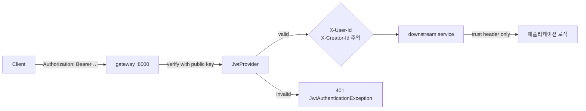

# gateway-service

> 모든 외부 요청의 단일 진입점 — JWT 검증 · 라우팅 · 신뢰 헤더 주입을 담당
>
> **Maintainer:** [@leeejunu](https://github.com/leeejunu)

CineStream 의 모든 외부 트래픽은 이 게이트웨이를 거친다. 인증·라우팅·신뢰 경계를 한 곳에 두어 백엔드 서비스를 무상태(stateless) 로 유지하고, 다운스트림 서비스는 게이트웨이가 주입한 헤더만 신뢰하면 되도록 설계했다. 상위 [루트 README](../README.md) 도 함께 참조.

---

## Responsibilities

- **JWT 검증** — `Authorization: Bearer …` 토큰의 서명·만료를 모든 요청 진입 시 1회 검증
- **신뢰 헤더 주입** — 검증된 토큰의 subject 를 `X-User-Id` / `X-Creator-Id` 로 변환해 다운스트림에 전달
- **Path-based 라우팅** — `/api/users/**`, `/api/tickets/**`, `/api/streaming/**` 등을 각 서비스로 분배
- **공개 / 비공개 엔드포인트 분리** — 로그인·회원가입·OAuth 콜백은 토큰 없이 통과
- **에러 응답 표준화** — `JwtAuthenticationException` → 401 응답 본문을 일관된 포맷으로

---

## Tech Stack


다운스트림 서비스가 무상태로 동작할 수 있도록, 게이트웨이는 **DB / Redis 의존이 없는 순수 reactive 프록시** 로 유지한다.

---

## Architecture

```
com.example.gatewayservice/
├── filter/
│   ├── AuthenticationFilter.java   ← JWT 검증 + 헤더 주입
│   ├── GlobalFilter.java           ← 공통 필터 (요청 로깅 등)
│   └── GlobalGatewayFilterFactory.java
├── util/
│   └── JwtProvider.java            ← 공개키 기반 서명 검증
├── config/
│   ├── SecurityConfig.java         ← Reactive Security
│   └── ReactiveAuthorization.java  ← URL 패턴별 인증 정책
├── exception/
│   ├── JwtAuthenticationException.java
│   └── JwtAuthenticationExceptionHandler.java
└── GatewayServiceApplication.java
```

### 인증 흐름



핵심 원칙:

- **토큰은 게이트웨이에서만 파싱**한다. 다운스트림 서비스는 헤더 `X-User-Id` / `X-Creator-Id` 만 신뢰하고 자체 토큰 검증을 하지 않는다.
- **공개키 기반 서명 검증** — 비밀키는 user-service / creator-service 가 토큰 발급 시에만 보유, 게이트웨이는 공개키만 가진다.
- **공개 엔드포인트** (`/api/users/login`, `/api/oauth2/**`, `/api/creators/login` 등) 는 `ReactiveAuthorization` 에서 화이트리스트 처리 후 토큰 없이 통과시킨다.

---

## 라우팅

라우트 타깃은 `application.yaml` 의 `BASE_IP` + 서비스별 포트 환경변수로 구성된다 (예: `CLIENT_TICKET_PORT=8084`). prod 환경에서는 docker / k8s 의 서비스 디스커버리 이름이 들어간다.

| Path | Service |
|---|---|
| `/api/users/**`, `/api/auth/**`, `/api/oauth2/**` | user-service |
| `/api/creators/**` | creator-service |
| `/api/payments/**` | payment-service |
| `/api/settlements/**`, `/api/wallets/**` | settlement-service |
| `/api/tickets/**`, `/api/carts/**`, `/api/queues/**`, `/api/schedules/**` | ticket-service |
| `/api/movies/**`, `/api/categories/**`, `/api/reviews/**` | movie-service |
| `/api/streaming/**` | streaming-service |
| `/api/recommendations/**` | ai-service |

---

## Dependencies

| 종류 | 대상 |
|---|---|
| Inbound | 모든 외부 클라이언트 (FE) |
| Outbound | 8개 백엔드 서비스 (HTTP) |
| Infra | 없음 (stateless) |

---

## Run

```bash
./gradlew bootRun                     # dev profile, port 8000
SPRING_PROFILES_ACTIVE=prod ./gradlew bootRun
./gradlew test
```

주요 prod 환경변수: `BASE_IP`, `CLIENT_USER_PORT`, `CLIENT_CREATOR_PORT`, `CLIENT_TICKET_PORT`, `CLIENT_STREAMING_PORT`, …, `JWT_PUBLIC_KEY`, `SERVER_PORT`.

---

## 추가 자료

- 라우팅 / 환경변수 — [docs/env-guide.md](../docs/env-guide.md)
- 배포 — [docs/DEPLOYMENT.md](../docs/DEPLOYMENT.md)