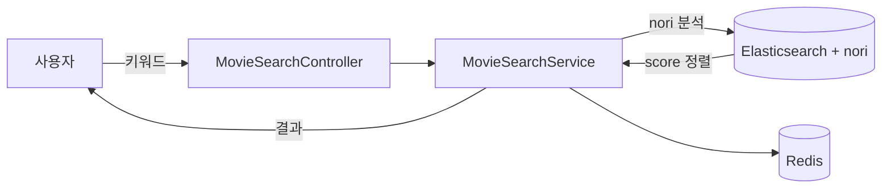
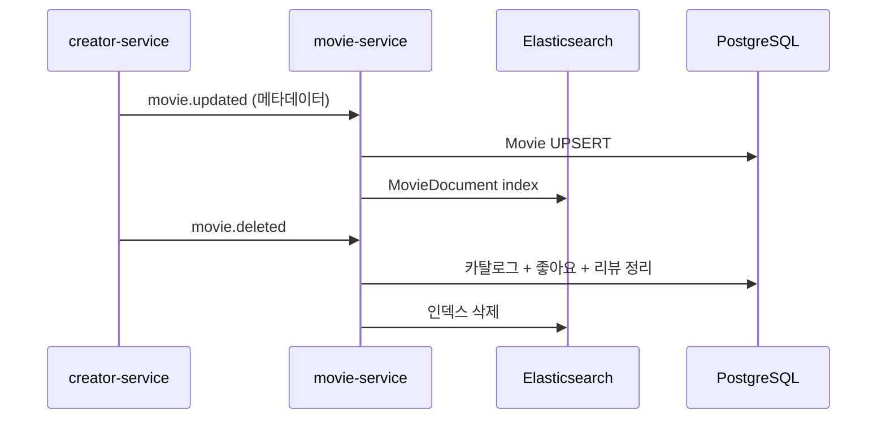

# movie-service

> 영화 카탈로그 · Elasticsearch nori 한글 검색 · 좋아요 · 리뷰 · 인기 키워드를 담당
>
> **Maintainers:** [@JunHeeCh](https://github.com/JunHeeCh) · [@jeongbeomgyu](https://github.com/jeongbeomgyu) · [@y0000h](https://github.com/y0000h)

사용자가 보는 **영화 카탈로그의 단일 진실 공급원**. creator-service 가 발행한 영화 메타데이터를 Kafka 로 받아 자기 스키마로 적재하고, **Elasticsearch nori 분석기 기반 한글 검색** · **자동완성** · **인기 키워드** · **카테고리 필터링** · **좋아요/리뷰** 를 제공한다. 다른 서비스와 데이터 소유권을 분명히 분리해 (creator 가 원본 소유, movie 는 읽기 최적화 사본 소유) 검색·좋아요·리뷰 같은 사용자 흐름을 빠르게 처리한다. 상위 [루트 README](../README.md) 도 함께 참조.

---

## Responsibilities

- 영화 카탈로그 사본 적재 (Kafka consume from creator-service)
- 사용자가 본 영화 검색 / 자동완성 / 인기 키워드 (Elasticsearch + nori)
- 카테고리·필터 카운트 집계
- 영화 좋아요 (`MovieLike`) 적재 + Kafka publish (`movie.liked`)
- 리뷰(Review) 작성 / 수정 / 삭제 + 평균 평점 통계
- 리뷰 권한 동기화 — `ticket.review.authorized` 컨슘하여 `ReviewAuthorization` 적재
- 영화별 평점 통계 (`MovieRatingStats`)

---

## Tech Stack


---

## Architecture (Hexagonal)

```
com.example.movieservice/
├── domain/
│   ├── model/                    ← Movie, Schedule, Category, Review,
│   │                                ReviewAuthorization, MovieLike, UserSync, Creator
│   └── repository/               ← *Repository (port), MovieRatingStats (projection)
├── application/
│   ├── usecase/                  ← MovieUseCase, MovieSearchUseCase, ReviewUseCase,
│   │                                CategoryUseCase, CreatorUseCase
│   ├── service/                  ← MovieService, MovieSearchService, ReviewService,
│   │                                LikeService, MovieBatchService, …
│   └── event/                    ← EventPublisher, MovieLikedEvent
├── infrastructure/
│   ├── persistence/              ← *JpaRepository + *RepositoryImpl
│   ├── elasticsearch/
│   │   ├── MovieDocument         ← @Document, nori 토크나이저
│   │   ├── MovieSearchRepository ← Spring Data ES
│   │   └── MovieIndexInitializer ← 부팅 시 인덱스 매핑 보정
│   ├── kafka/
│   │   ├── consumer/             ← CreatorEventConsumer, MovieEventConsumer,
│   │   │                            ReviewAuthConsumer, TicketEventConsumer,
│   │   │                            UserSyncConsumer
│   │   ├── producer/             ← KafkaEventPublisher
│   │   ├── listener/             ← MovieLikeEventListener (AFTER_COMMIT)
│   │   └── dto/                  ← consume / publish DTO
│   └── redis/RedisConfig         ← 조회 캐시
└── presentation/controller/      ← MovieSearchController, ReviewController,
                                    LikeController, CategoryController, …
```

---

## 핵심 흐름

### Elasticsearch 한글 검색



- **nori 분석기** — `local/elasticsearch/docker-compose.yaml` 에서 `analysis-nori` 플러그인을 포함해 띄운다. 한글 형태소 분석으로 `검색`, `검색하다`, `검색기` 등을 같은 어근으로 매칭.
- **인덱스 초기화** — `MovieIndexInitializer` 가 부팅 시 매핑이 없으면 자동 생성. 운영에서는 이중 안전장치 역할.
- **자동완성** — 별도 매핑 (edge n-gram 또는 completion suggester) 으로 `AutocompleteResponse` 반환.

### Kafka 단방향 동기화 (creator → movie)



- creator 가 원본 소유, movie 는 읽기 최적화 사본만 보유한다 — 도메인 데이터의 단일 진실은 creator 에 있고, movie 는 검색 / 통계용 사본을 자기 일정으로 갱신한다.
- `UserSync` 엔티티로 user-service 의 닉네임·프로필 변경을 컨슘 받아 리뷰 작성자 정보를 자체 보관 (조인 회피).

### 리뷰 권한

ticket-service 가 `startTime - 10m` 시점에 `ticket.review.authorized` 를 발행한다. movie-service 의 `ReviewAuthConsumer` 가 받아 `ReviewAuthorization` 을 적재하고, 이후 `POST /api/reviews` 시 이 권한 row 가 있어야 작성 가능.

---

## Kafka Topics

| Topic | Direction | Purpose |
|---|---|---|
| `creator.created`, `creator.updated` | inbound | 카탈로그용 크리에이터 사본 |
| `movie.updated`, `movie.visibility.changed`, `movie.deleted` | inbound | 영화 메타데이터 동기화 |
| `ticket.reserved`, `ticket.cancelled` | inbound | 예매 이벤트 (통계 / 후속 처리) |
| `ticket.review.authorized` | inbound | 리뷰 작성 권한 발행 |
| `user.created`, `user.updated`, `user.deleted` | inbound | UserSync 갱신 |
| `movie.liked` | outbound | 좋아요 발생 (user / ai 가 컨슘) |

---

## API (요약)

| 메서드 | 경로 | 설명 |
|---|---|---|
| `GET` | `/api/movies/search?q=…` | 키워드 검색 (nori 분석) |
| `GET` | `/api/movies/autocomplete?q=…` | 자동완성 |
| `GET` | `/api/movies/popular-keywords` | 인기 키워드 |
| `GET` | `/api/movies/{id}` | 영화 상세 (사용자용) |
| `POST` `DELETE` | `/api/movies/{id}/like` | 좋아요 토글 |
| `GET` | `/api/movies/{id}/reviews` | 리뷰 목록 |
| `POST` `PATCH` `DELETE` | `/api/reviews/**` | 리뷰 작성·수정·삭제 |

자세한 스펙은 Swagger UI `http://localhost:8086/swagger-ui.html`.

---

## Dependencies

| 종류 | 대상 |
|---|---|
| Kafka inbound | 위 표의 8종 |
| Kafka outbound | `movie.liked` |
| Infra | PostgreSQL `movie_db`, Elasticsearch 8 (+ nori), Redis 7, Kafka |

---

## Run

```bash
cd local/elasticsearch && docker-compose up -d   # ES + nori 먼저 띄우기
./gradlew bootRun                                # dev profile, port 8086
SPRING_PROFILES_ACTIVE=prod ./gradlew bootRun
./gradlew test
```

주요 prod 환경변수: `DB_HOST`, `ELASTICSEARCH_URIS`, `REDIS_HOST`, `KAFKA_BOOTSTRAP_SERVERS`.

---

## 추가 자료

- 추가 문서 — [docs/README.md](docs/README.md)
- 환경변수 — [../docs/env-guide.md](../docs/env-guide.md)