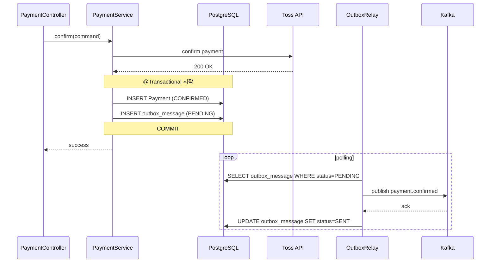

# payment-service

> Toss Payments 외부 결제 처리 + Outbox 패턴으로 신뢰성 있는 결제 이벤트 발행
>
> **Maintainer:** [@y0000h](https://github.com/y0000h)

외부 결제(Toss) 와 내부 도메인 사이를 잇는 서비스. **결제 승인** 과 **결제 이벤트 발행** 이라는 두 부수효과를 한 트랜잭션 안에서 안전하게 다루기 위해 **Outbox 패턴** 을 적용했다 — DB 와 Kafka 사이의 dual write 문제를 회피하고, broker 장애에도 메시지 유실이 없도록 보장한다. 상위 [루트 README](../README.md) 도 함께 참조.

---

## Responsibilities

- Toss Payments 결제 승인 / 환불 호출
- Payment / Refund 도메인 엔티티 영속화 (PENDING → CONFIRMED → REFUNDED)
- 결제 결과 이벤트 발행 — `payment.confirmed`, `payment.refunded`, `payment.failed`
- Outbox 패턴으로 DB 커밋과 Kafka 발행을 atomically 묶기

---

## Tech Stack


---

## Architecture

```
com.example.paymentservice/
├── payment/
│   ├── domain/
│   │   ├── model/Payment.java
│   │   ├── PaymentStatus.java
│   │   └── repository/PaymentRepository.java
│   ├── application/
│   │   ├── PaymentService.java
│   │   └── dto/                         ← PaymentConfirmCommand, PaymentInfo
│   ├── client/
│   │   ├── PaymentGateway.java          ← (port)
│   │   └── toss/                        ← TossPaymentClient, TossPaymentProperties, *DTO
│   ├── infrastructure/                  ← PaymentJpaRepository, PaymentRepositoryAdapter
│   └── presentation/                    ← PaymentController, PaymentConfirmRequest
├── refund/
│   ├── domain/Refund, RefundStatus
│   ├── application/RefundService, *Dto
│   ├── client/toss/                     ← TossRefundClient
│   ├── infrastructure/                  ← RefundJpaRepository, RefundRepositoryAdapter
│   └── presentation/                    ← RefundController
└── common/
    ├── exception/                       ← BusinessException, ErrorCode
    ├── messaging/
    │   ├── PaymentTopics.java
    │   └── dto/                         ← PaymentConfirmedMessage, PaymentRefundedMessage,
    │                                       PaymentFailedMessage
    └── outbox/
        ├── domain/model/OutboxMessage.java
        ├── domain/repository/OutboxRepository.java
        ├── application/
        │   ├── OutboxEnqueuer.java      ← DB tx 내에서 outbox row 적재
        │   └── OutboxRelay.java         ← 폴링하며 Kafka publish
        ├── infrastructure/              ← OutboxJpaRepository, OutboxRepositoryAdapter
        ├── OutboxConfig.java
        ├── OutboxProperties.java
        └── OutboxStatus.java            ← PENDING / SENT / FAILED
```

### Outbox 패턴



핵심 이점:

- **DB 와 Kafka 사이 dual write 문제 해결** — 트랜잭션 내에서 outbox row 만 적재하고, Kafka 발행은 별도 relay 가 폴링한다. DB 커밋이 실패하면 outbox row 도 없으므로 가짜 메시지가 발행되지 않는다.
- **Kafka broker 장애에 안전** — broker 가 일시 장애여도 outbox 에 메시지가 누적될 뿐 결제 자체는 성공한다. 복구 후 relay 가 자동 재시도.
- **At-least-once 보장** — consumer 측에서 멱등 처리로 보완한다 (예: ticket-service 의 `payment_id` 기반 중복 차단).

---

## Kafka Topics

| Topic | Direction | Purpose |
|---|---|---|
| `payment.confirmed` | outbound (via Outbox) | 결제 승인 — ticket-service 가 RESERVED → CONFIRMED 전이 |
| `payment.refunded` | outbound (via Outbox) | 환불 완료 — ticket-service / user-service 가 후속 처리 |
| `payment.failed` | outbound (via Outbox) | 결제 실패 — ticket-service 가 stock 복구 / queue.drain |

---

## API (요약)

| 메서드 | 경로 | 설명 |
|---|---|---|
| `POST` | `/api/payments/confirm` | Toss 결제 승인 + 도메인 적재 |
| `POST` | `/api/payments/refund` | Toss 환불 호출 + Refund 적재 |

자세한 스펙은 Swagger UI `http://localhost:8081/swagger-ui.html`.

---

## Dependencies

| 종류 | 대상 |
|---|---|
| HTTP outbound | Toss Payments (`api.tosspayments.com`) |
| Kafka outbound | `payment.confirmed`, `payment.refunded`, `payment.failed` (Outbox relay 통해) |
| Infra | PostgreSQL `payment_db`, Kafka |

---

## Run

```bash
./gradlew bootRun                     # dev profile, port 8081
SPRING_PROFILES_ACTIVE=prod ./gradlew bootRun
./gradlew test
```

주요 prod 환경변수: `DB_HOST`, `KAFKA_BOOTSTRAP_SERVERS`, `TOSS_SECRET_KEY`, `TOSS_BASE_URL`, `OUTBOX_RELAY_INTERVAL_MS`, `OUTBOX_BATCH_SIZE`.

---

## 추가 자료

- 환경변수 — [docs/env-guide.md](../docs/env-guide.md)
- 배포 — [docs/DEPLOYMENT.md](../docs/DEPLOYMENT.md)
