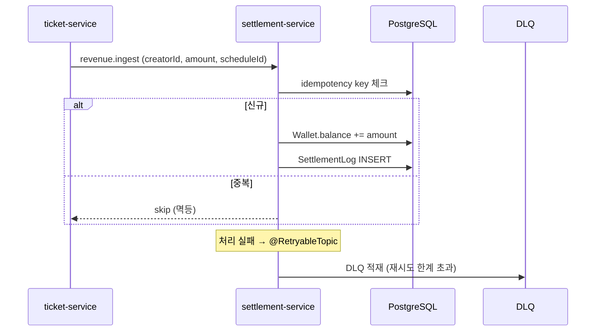
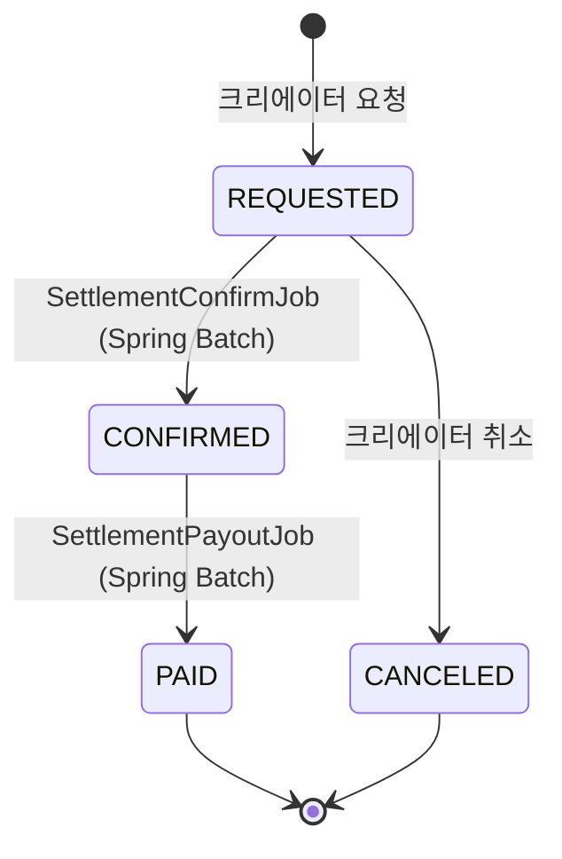

# settlement-service

> 크리에이터 지갑(Wallet) · 정산(Settlement) · 페이아웃 + 멱등 보장 + DLQ 재처리
>
> **Maintainer:** [@jeongbeomgyu](https://github.com/jeongbeomgyu)

크리에이터에게 흘러가는 돈을 다루는 서비스. **잔액 일관성** · **멱등 정산 요청** · **실패한 메시지의 자동 재시도와 데드레터 큐 분리** · **Spring Batch 기반 일괄 페이아웃** 을 갖춘다. 이 서비스가 잘못되면 돈이 새거나 두 번 나가므로, 도메인 모델·메시징·배치 모두 장애 대응 관점에서 설계되어 있다. 상위 [루트 README](../README.md) 도 함께 참조.

---

## Responsibilities

- 크리에이터 지갑(Wallet) 생성·조회 (수익 적립 잔액)
- 매출 인입 — Kafka `revenue.ingest` 메시지를 받아 Wallet 잔액 증분
- 정산(Settlement) 요청 — 사용자가 지갑 잔액의 일부 또는 전부를 출금 요청
- 정산 상태 전이 (REQUESTED → CONFIRMED → PAID, 또는 CANCELED)
- Spring Batch 로 일괄 confirm / payout 처리
- DLQ — 처리 실패 메시지를 격리하고 운영자가 재처리

---

## Tech Stack


---

## Architecture (Hexagonal)

```
com.example.settlementservice/
├── domain/
│   ├── common/                       ← Money, FeePolicy
│   ├── settlement/                   ← Settlement, SettlementLog, SettlementStatus,
│   │                                    SettlementLedgerDirection / EntryType,
│   │                                    InvalidSettlementStateException
│   └── wallet/                       ← Wallet, InsufficientBalanceException
├── application/
│   ├── port/in/                      ← *UseCase (CancelSettlement, GetSettlement,
│   │                                            GetWalletBalance, IngestRevenue,
│   │                                            RequestSettlement)
│   ├── port/out/                     ← SettlementRepository, WalletRepository,
│   │                                    SettlementLogRepository, PayoutPort,
│   │                                    CreatorPayoutQueryPort, CreatorPayoutSnapshot
│   ├── service/                      ← SettlementService, RevenueIngestService,
│   │                                    SettlementRequestExecutor,
│   │                                    WalletCreationService, WalletQueryService
│   └── exception/                    ← SettlementNotFound, WalletNotFound,
│                                       DuplicateIdempotencyKey, …
├── infrastructure/
│   ├── persistence/                  ← *JpaRepository + *Delegate, PermanentFailureEvent
│   ├── batch/                        ← SettlementConfirmJobConfig,
│   │                                    SettlementPayoutJobConfig, BatchScheduler
│   ├── kafka/
│   │   ├── RevenueIngestListener
│   │   ├── DlqProducer, DlqReprocessListener
│   │   ├── DlqMessage, RevenueIngestEventPayload
│   │   └── CreatorCreatedListener (지갑 자동 생성)
│   ├── creator/                      ← CreatorRestAdapter (HTTP → creator-service)
│   ├── payout/                       ← StubPayoutAdapter (실제 PG 연동 포인트)
│   └── config/                       ← KafkaConfig, RestClientConfig, SchedulingConfig
└── presentation/web/                 ← SettlementController, WalletController,
                                       GlobalExceptionHandler
```

---

## 핵심 흐름

### 매출 인입 (Kafka)



- **Idempotency key** 로 중복 적재를 차단 — `DuplicateIdempotencyKeyException` 으로 거른다.
- **`SettlementLog`** 가 더블엔트리 장부 역할 — 모든 잔액 변경을 추적해 사후 검증 가능.

### 정산 요청 → 배치 처리



- **SettlementConfirmJobConfig** — REQUESTED 정산을 검증하고 CONFIRMED 로 전이 (페이아웃 계좌 조회는 `CreatorRestAdapter` 가 creator-service 에 HTTP 호출).
- **SettlementPayoutJobConfig** — 실제 지급 (현재 `StubPayoutAdapter`, 추후 PG 연동 지점). 성공 시 PAID, 영구 실패면 `PermanentFailureEvent` 적재.
- **BatchScheduler** 가 cron 으로 두 잡을 차례로 트리거.

### DLQ 재처리

`@RetryableTopic` 으로 일시 장애는 자동 재시도하고, 한계 초과 시 `DlqProducer` 가 DLQ 토픽에 적재한다. 운영자는 `DlqReprocessListener` 의 admin 엔드포인트를 통해 수동 재처리할 수 있다.

---

## API (요약)

| 메서드 | 경로 | 설명 |
|---|---|---|
| `POST` | `/api/settlements` | 정산 요청 |
| `GET` | `/api/settlements/{id}` | 정산 단건 조회 |
| `DELETE` | `/api/settlements/{id}` | 정산 취소 (REQUESTED 만) |
| `GET` | `/api/wallets/{creatorId}` | 지갑 잔액 조회 |

---

## Dependencies

| 종류 | 대상 |
|---|---|
| HTTP outbound | `creator-service` — 페이아웃 계좌 조회 |
| Kafka inbound | `revenue.ingest`, `creator.created` |
| Kafka outbound (DLQ) | `*-dlt` 접미사 |
| Infra | PostgreSQL `settlement_db`, Kafka |

---

## Run

```bash
./gradlew bootRun                     # dev profile, port 8083
SPRING_PROFILES_ACTIVE=prod ./gradlew bootRun
./gradlew test
```

주요 prod 환경변수: `DB_HOST`, `KAFKA_BOOTSTRAP_SERVERS`, `CLIENT_CREATOR_BASE_URL`, `BATCH_CONFIRM_CRON`, `BATCH_PAYOUT_CRON`, `FEE_POLICY_*`.

---

## 추가 자료

- 배포 — [docs/DEPLOYMENT.md](../docs/DEPLOYMENT.md)
- 환경변수 — [docs/env-guide.md](../docs/env-guide.md)