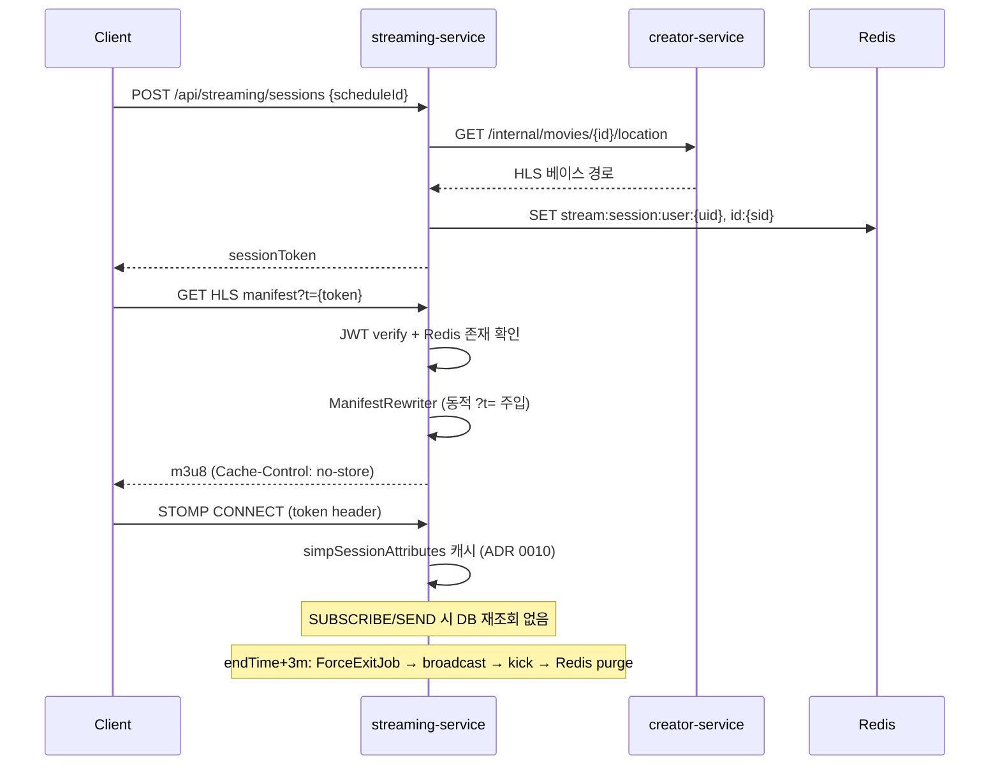

# streaming-service

> 라이브 HLS 송출 · WebSocket 채팅 · 동시 시청자 · sessionToken 발급 / 검증을 담당
>
> **Maintainer:** [@corinB](https://github.com/corinB)

ticket-service 와 함께 도메인 복잡도가 높은 서비스. 한 번 발급된 sessionToken 으로 HLS 매니페스트와 STOMP 채팅 두 채널을 모두 검증하고, 종료 시각 + 3분에 모든 세션을 강제 종료한다. 상위 [루트 README](../README.md) 도 함께 참조.

---

## Responsibilities

- 단일 sessionToken (HS256 JWT) 발급 — HLS `?t=…` 쿼리 / STOMP CONNECT 헤더에서 모두 사용
- HLS 매니페스트 / 세그먼트 서빙 (path traversal 방어 + `Cache-Control: no-store`)
- 스케줄 상태 broadcast — `LOBBY_OPEN → STARTING_SOON → STARTED → ENDING_SOON → ENDED → FORCE_EXIT`
- 동시 시청자 수 SET 관리, 채팅 rate limit (1초)
- `endTime + 3m` 도달 시 모든 세션 강제 kick + Redis purge

---

## Tech Stack


---

## Architecture (Hexagonal)

```
com.example.streamingservice/
├── domain/
│   ├── entity/         ← Schedule, Entitlement
│   ├── enums/          ← ScheduleStatus, StreamState, SessionKickReason
│   └── repository/     ← *Repository (port)
├── application/
│   ├── usecase/        ← EnterStream, HlsServing, Chat, Lifecycle, ViewerCount
│   ├── service/        ← *ServiceImpl
│   ├── port/           ← StreamTokenPort, SessionCachePort, ViewerCachePort,
│   │                      ChatRateLimitPort, StreamAddressPort,
│   │                      MovieLocationPort, StateBroadcastPort,
│   │                      KickNotifierPort, SchedulerPort
│   ├── dto/            ← record command/result/message
│   ├── exception/      ← ErrorCode + *Exception 팩토리
│   └── constants/      ← RedisKeys, WsDestinations
├── infrastructure/
│   ├── persistence/    ← JpaRepository + RepositoryImpl
│   ├── cache/          ← RedisSessionCacheAdapter, RedisViewerCacheAdapter, …
│   ├── token/          ← JjwtStreamTokenAdapter
│   ├── address/        ← LocalDirectStreamAddressAdapter
│   ├── http/           ← CreatorMovieLocationAdapter (RestClient)
│   ├── messaging/      ← Kafka *Consumer
│   ├── scheduler/      ← QuartzSchedulerAdapter, *Job
│   ├── websocket/      ← WebSocketStateBroadcastAdapter, KickNotifierAdapter
│   └── util/
├── presentation/       ← StreamingSessionController, HlsController,
│                          GlobalExceptionHandler
└── config/             ← WebSocketConfig, QuartzConfig, KafkaConfig
```

### Ports → Adapters

| Port | Adapter |
|---|---|
| `StreamTokenPort` | `JjwtStreamTokenAdapter` |
| `SessionCachePort` | `RedisSessionCacheAdapter` |
| `ViewerCachePort` | `RedisViewerCacheAdapter` |
| `ChatRateLimitPort` | `RedisChatRateLimitAdapter` |
| `StreamAddressPort` | `LocalDirectStreamAddressAdapter` (현재) |
| `MovieLocationPort` | `CreatorMovieLocationAdapter` (RestClient) |
| `StateBroadcastPort` | `WebSocketStateBroadcastAdapter` |
| `KickNotifierPort` | `WebSocketKickNotifierAdapter` |
| `SchedulerPort` | `QuartzSchedulerAdapter` |

---

## sessionToken 정책

- HS256 JWT (JJWT), `sub = sessionId(UUID)`, `exp = endTime + 3m`
- 발급: `POST /api/streaming/sessions` 1회만, 클라이언트가 HLS / WS 양쪽에 재사용
- HLS 매체 — `?t=...` 쿼리 (`ManifestRewriter` 가 매니페스트에 동적 주입)
- WS 매체 — STOMP CONNECT 프레임의 `token` 헤더
- 검증 — JWT 서명 + Redis `stream:session:id:{sessionId}` 존재 여부 (이중 유효성)

상세는 `docs/TOKEN.md`.

---

## Redis Keys

세션 / 뷰어 TTL 은 모두 `endTime + 3m`, rate limit 은 1초.

| Key | Type | 용도 |
|---|---|---|
| `stream:session:user:{userId}` | HASH | 유저당 현재 세션 (단일 세션 강제) |
| `stream:session:id:{sessionId}` | HASH | 토큰 sub → `(userId, scheduleId)` 역방향 조회 |
| `stream:viewers:schedule:{scheduleId}` | SET | 동시 시청자 (userId 집합) |
| `stream:ratelimit:chat:{userId}` | STRING | 채팅 rate limit 카운터 (TTL 1s) |

키 빌더는 `application/constants/RedisKeys.java`.

---

## Quartz Jobs (스케줄당 6개)

JobKey 네이밍: `schedule-{scheduleId}-{kind}` / `replaceExisting=true`.

| Job | Trigger | 동작 |
|---|---|---|
| `LobbyOpenJob` | `startTime - 10m` | `/topic/state/schedule/{id}` ← `LOBBY_OPEN` |
| `StartingSoonJob` | `startTime - 1m` | `STARTING_SOON` broadcast |
| `StartedJob` | `startTime` | `STARTED` broadcast (HLS 서빙 가능 전이) |
| `EndingSoonJob` | `endTime - 1m` | `ENDING_SOON` broadcast |
| `EndedJob` | `endTime` | `ENDED` broadcast (HLS 서빙 중단) |
| `ForceExitJob` | `endTime + 3m` | `FORCE_EXIT` broadcast + 전체 kick + Redis purge |

---

## Kafka Topics

| Topic | Direction | 용도 |
|---|---|---|
| `movie.schedule.confirmed` | inbound | 스케줄 사본 + Quartz 6 Job 등록 |
| `ticket.review.authorized` | inbound | Entitlement 적재 |

DLT 는 `*-dlt` 접미사. 리스너 패턴은 `@RetryableTopic(attempts=3, BackOff=@BackOff(delay=1000, multiplier=2.0))` + `@DltHandler`. payload 는 `String` 으로 받고 `KafkaMessageUtil.deserialize(message, Class)` 로 파싱한다 (Spring `JsonDeserializer` 미사용).

---

## 핵심 흐름



---

## 주의 사항

- **단일 노드 가정** (ADR 0002) — Quartz `isClustered=false`, WebSocket SimpleBroker, Redis Pub/Sub 미사용. 수평 확장 시 재설계 필요.
- **path traversal 방어** — `LocalDirectStreamAddressAdapter` 가 `Path.normalize().startsWith(baseDir)` 체크 + 파일명 whitelist `^[A-Za-z0-9_-]+\.(m3u8|ts)$`.
- **매니페스트 응답 `Cache-Control: no-store` 필수** — 토큰이 URL 에 있으므로 캐시 금지.
- **WebSocket CONNECT 1회 검증 + `simpSessionAttributes` 캐시** (ADR 0010) — SUBSCRIBE/SEND 에서 DB 재조회 안 함.
- **채팅 닉네임은 서버 계산** (`"관람객#" + ticketId`) — 클라이언트 nickname 신뢰 금지.
- **`ffmpeg-cli-wrapper` 의존성은 선언만 유지 · 미사용** — HLS 산출물은 creator-service 가 생성, streaming 은 읽기만.
- **`application-dev.yaml` 은 gitignored** — 팀원 간 공유 안 됨.

---

## Dependencies

| 종류 | 대상 |
|---|---|
| HTTP outbound | `creator-service` — `GET /internal/movies/{id}/location` |
| Kafka inbound | `movie.schedule.confirmed`, `ticket.review.authorized` |
| Infra | PostgreSQL `streaming_db`, Redis 7, Kafka |

---

## Run

```bash
./gradlew bootRun                     # dev profile, port 8088
SPRING_PROFILES_ACTIVE=prod ./gradlew bootRun
./gradlew test
./gradlew test --tests "ScheduleTest"
```

주요 prod 환경변수: `DB_HOST`, `REDIS_HOST`, `KAFKA_BOOTSTRAP_SERVERS`, `CLIENT_CREATOR_BASE_URL`, `JWT_SECRET`, `STREAM_BASE_DIR`, `STREAMING_LOBBY_LEAD`, `STREAMING_SOON_LEAD`, `STREAMING_POST_GRACE`.

---

## 추가 자료

- `docs/ARCHITECTURE.md` — 포트폴리오용 원페이지 요약
- `docs/OVERVIEW.md` — 서비스 한눈 개요
- `docs/DESIGN.md` — 상세 설계 + 플로우 다이어그램 7종
- `docs/API.md` — HTTP + WebSocket 스펙
- `docs/DOMAIN-MODEL.md` — 엔티티 / DDL / enum
- `docs/TOKEN.md` — sessionToken 상세
- `docs/MESSAGE-SCHEMAS.md` — Kafka payload
- `docs/CONFIG.md` — property 레퍼런스
- `docs/RUNBOOK.md` — 구동 절차 + Smoke Test
- `docs/TROUBLESHOOTING.md` — 운영 문제 / 해결
- `docs/ONBOARDING.md` — 신규 팀원 1시간 가이드
- `docs/adr/` — 핵심 결정 5건 (0002 / 0003 / 0005 / 0010 / 0012)
- Claude 가이드 — [CLAUDE.md](CLAUDE.md)