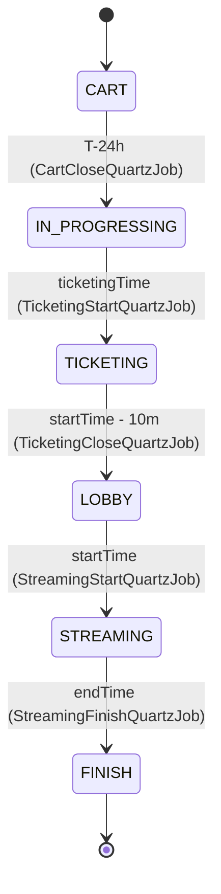

# ticket-service

> 티켓 라이프사이클 · 대기열 / 재고 · 결제 보상 트랜잭션 · 일일 배치를 담당하는 핵심 도메인 서비스
>
> **Maintainer:** [@corinB](https://github.com/corinB)

CineStream 모노레포에서 **도메인 복잡도가 가장 높은 서비스**다. 한정된 좌석, 동시 접속, 결제·환불, 외부 HTTP 호출과 DB 트랜잭션 사이의 일관성 문제를 한 곳에서 풀어낸다. 상위 [루트 README](../README.md) 도 함께 참조.

---

## Responsibilities

- 영화 스케줄 라이프사이클 관리 (`CART → IN_PROGRESSING → TICKETING → LOBBY → STREAMING → FINISH`)
- Redis 기반 선착순 대기열 / 재고 / 결제 진행 카운터
- 셀프 결제 (RESERVED → CONFIRMED) · 환불 보상 트랜잭션
- 큐 드레인 (재고 복구 시 대기 사용자 자동 처리)
- 일일 배치 (`provideFlag` 일괄 갱신, CONFIRMED 미지급 티켓 정산 트리거)

---

## Tech Stack


---

## Architecture (Hexagonal)

```
com.example.ticketservice/
├── domain/
│   ├── entity/          ← Ticket, Schedule, Cart
│   ├── enums/           ← ScheduleStatus, …
│   └── repository/      ← *Repository (port interfaces)
├── application/
│   ├── usecase/         ← TicketUseCase, CartUseCase, QueueUseCase, …
│   ├── service/         ← *ServiceImpl
│   ├── port/            ← CachePort, EventPublisherPort, UserPort,
│   │                       SchedulerPort, *BatchPort
│   ├── event/           ← TicketingStartedEvent, TicketPaidEvent, … (records)
│   ├── dto/
│   └── constants/       ← RedisKeys
├── infrastructure/
│   ├── persistence/     ← JpaRepository + RepositoryImpl (3-tier)
│   ├── cache/           ← RedisCacheAdapter
│   ├── messaging/       ← KafkaEventPublisher, KafkaTopics, *Consumer
│   ├── scheduler/       ← QuartzSchedulerAdapter, *QuartzJob
│   ├── http/            ← UserClient (RestClient)
│   ├── batch/           ← TicketProvideBatchAdapter, TicketCleanupBatchAdapter
│   └── event/           ← TicketEventListener (@TransactionalEventListener)
├── presentation/        ← TicketController, CartController, QueueController, …
└── common/              ← TicketException, ScheduleException, ErrorCode, PageResult
```

### Ports → Adapters

| Port | Adapter |
|---|---|
| `EventPublisherPort` | `KafkaEventPublisher` (extends `AbstractKafkaPublisher`) |
| `CachePort` | `RedisCacheAdapter` |
| `UserPort` | `UserClient` (RestClient) |
| `SchedulerPort` | `QuartzSchedulerAdapter` |
| `TicketProvideBatchPort` | `TicketProvideBatchAdapter` |
| `TicketCleanupBatchPort` | `TicketCleanupBatchAdapter` |

### Repository 3단 패턴

```
domain.repository.TicketRepository  (port)
  ↑ implemented by
infrastructure.persistence.impl.TicketRepositoryImpl
  ↑ delegates to
infrastructure.persistence.TicketJpaRepository
```

---

## 핵심 도메인 흐름

### Schedule Lifecycle



- **CART** — Redis `cart:count:schedule:{id}` 카운터로 수요 추정. INCR/DECR 는 `CartUpdatedEvent` AFTER_COMMIT 으로 발화 (DB 롤백 시 stale 카운터 방지).
- **IN_PROGRESSING / TICKETING** — `CartCloseQuartzJob` 이 T-24h 에 발화: 수요 ≤ 좌석이면 일괄 RESERVED 생성 (Case A), 초과면 선착순 부분 예약 후 나머지 삭제 (Case B). `TicketingStartQuartzJob` 은 미결제 RESERVED 티켓을 정리하고 Redis `stock`/`paying`/`seats`/`cookie`/`startTime` 5개 키를 시드한다.
- **LOBBY** — TICKETING → LOBBY 전이 시 결제·큐 매수가 차단되고, 대기 중이던 사용자에게 `queue.terminated` 가 발행된다. 동일 시각에 streaming 의 `LobbyOpenJob` 도 발화.
- **STREAMING / FINISH** — 시간 기반 상태 전이만.

### 큐 드레인 (재고 복구 시 자동 처리)

환불 또는 결제 실패로 Redis `stock` 이 복구되면 `queue.drain` Kafka 토픽이 발행되고, `QueueDrainConsumer`(concurrency=4) 가 `checkAndProcess()` 를 동기로 호출한다. 이전 `@Async` 방식은 스레드 풀 고갈이 있어 Kafka 기반으로 마이그레이션됨.

### HTTP + DB 보상 트랜잭션

`UserPort.deductTicketFee()` 같은 외부 HTTP 호출 후 DB 가 롤백되면 쿠키가 잘못 차감된 채로 남는다. `CookieCompensationHelper.registerRollbackRefund()` 가 `TransactionSynchronization.afterCompletion()` 콜백으로 환불을 등록해 이 격차를 메운다 — `SelfPaymentService`, `QueuePurchaseProcessor` 에서 사용.

---

## Redis Keys

| Key | Type | 용도 |
|---|---|---|
| `cart:count:schedule:{scheduleId}` | STRING | CART 단계 수요 카운터 |
| `stock:schedule:{scheduleId}` | STRING | TICKETING 단계 잔여 좌석 |
| `queue:schedule:{scheduleId}` | ZSET | 대기열 (score = timestamp) |
| `paying:schedule:{scheduleId}` | STRING | 결제 진행 중인 사용자 카운터 |
| `seats:schedule:{scheduleId}` | STRING | 총 좌석 수 (ticketNum 계산용) |
| `cookie:schedule:{scheduleId}` | STRING | 티켓 가격 (쿠키) |
| `startTime:schedule:{scheduleId}` | STRING | 이벤트 시작 시각 (queue TTL 용 ISO-8601) |

키 빌더는 `application/constants/RedisKeys.java`. TICKETING 시작 시 시드된 키들은 `startTime - 10min` 에 자동 만료.

---

## Kafka Topics

| Topic | Direction | Purpose |
|---|---|---|
| `movie.schedule.confirmed` | inbound | Schedule 엔티티 생성 |
| `ticket.paid` | outbound | 셀프 결제 완료 |
| `ticket.refunded` | outbound | 환불 완료 |
| `cart.closed` | outbound | CartClose 완료 (Case A 일괄 / Case B 부분) |
| `ticketing.started` | outbound | TICKETING phase 시작 |
| `ticket.provide` | outbound | 일일 배치 정산 통지 |
| `queue.drain` | internal | `QueueDrainConsumer` → `checkAndProcess()` 트리거 |
| `queue.terminated` | internal | LOBBY 진입 시 대기열 종료 |
| `ticket.review.authorized` | outbound | CONFIRMED 보유자에 대한 리뷰 권한 발행 |

토픽명 상수는 `infrastructure/messaging/KafkaTopics.java`.

---

## Quartz Jobs

| Job | Trigger | Task |
|---|---|---|
| `CartCloseQuartzJob` | `ticketingTime - 24h` | Cart close, 일괄/부분 RESERVED 티켓 생성 |
| `TicketingStartQuartzJob` | `schedule.ticketingTime` | 미결제 정리, Redis 5 키 시드, → TICKETING |
| `TicketingCloseQuartzJob` | `schedule.startTime - 10m` | TICKETING → LOBBY, ticketing Redis 키 삭제, `queue.terminated` |
| `ReviewAuthQuartzJob` | `schedule.startTime - 10m` | CONFIRMED 보유자에 리뷰 권한 발행 |
| `StreamingStartQuartzJob` | `schedule.startTime` | LOBBY → STREAMING |
| `StreamingFinishQuartzJob` | `schedule.endTime` | STREAMING → FINISH |

---

## Dependencies

| 종류 | 대상 |
|---|---|
| HTTP outbound | `user-service` — `POST /internal/users/deduct/cookie`, `POST /internal/users/refund/cookie` |
| Kafka inbound | `movie.schedule.confirmed` |
| Kafka outbound | `ticket.paid`, `ticket.refunded`, `cart.closed`, `ticketing.started`, `ticket.provide`, `ticket.review.authorized` |
| Infra | PostgreSQL `ticket_db`, Redis 7, Kafka |

---

## Run

```bash
./gradlew bootRun                     # dev profile, port 8084
SPRING_PROFILES_ACTIVE=prod ./gradlew bootRun
./gradlew test                        # H2 in-memory
./gradlew test --tests "com.example.ticketservice.*"
```

주요 prod 환경변수: `DB_HOST`, `DB_USERNAME`, `DB_PASSWORD`, `REDIS_HOST`, `REDIS_PORT`, `KAFKA_BOOTSTRAP_SERVERS`, `CLIENT_USER_BASE_URL`, `SERVER_PORT`, 시연 오프셋 `TICKET_CART_CLOSE_LEAD` / `TICKET_TICKETING_CLOSE_LEAD`.

---

## E2E Test

`e2e/` 디렉토리에 Python 스위트 (`e2e_test.py`) 가 있다. 5개 시나리오 — Case A 일괄 예약 / Case B 부분 / SOLD_OUT / 잔액 부족 / 500 동시접속. 실행 중 서비스 필요. 데이터: `schedule_events.json`, `test_users.sql`.

---

## 추가 자료

- 도메인 / 흐름 — `docs/reference/domain/`, `docs/reference/flow/`
- 인프라 (Redis 키 / TTL 매트릭스, Quartz 체이닝, Kafka 상세, AFTER_COMMIT + CookieCompensationHelper) — `docs/reference/infra/`
- 트러블슈팅 (RES / TX / KFK / MEM / SCH 카테고리별 인시던트) — `docs/troubleshooting/`
- 학습 노트 (self-invocation, `setRollbackOnly`, Redis atomicity, Quartz) — `docs/study/`
- Claude 가이드 — [CLAUDE.md](CLAUDE.md)
