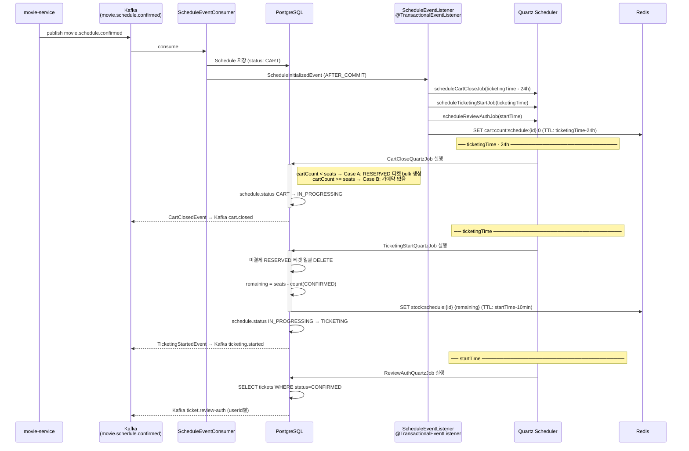
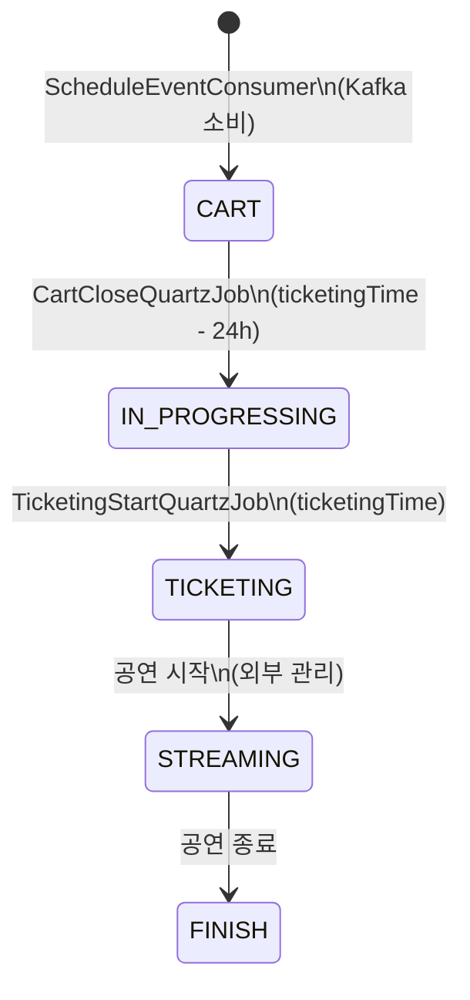

# 스케줄 확정 이벤트 → 티켓팅 전체 흐름

## 개요

movie-service가 스케줄을 확정하면 Kafka 이벤트를 발행하고, ticket-service는 이를 소비하여
Quartz Job을 등록한다. 이후 세 개의 Job이 체인으로 실행되며 티켓팅 전 과정을 자동 진행한다.

---

## 전체 타임라인



---

## 단계별 상세

### 1. Kafka 이벤트 소비 (`ScheduleEventConsumer`)

```
topic: movie.schedule.confirmed
payload: ScheduleConfirmedMessage {
  scheduleId, movieId, title, creatorId,
  startTime, endTime, ticketingTime,
  cookie, imageUrl, seats
}
```

- Schedule 엔티티 생성 및 저장 (초기 status: `CART`)
- `ScheduleInitializedEvent` 발행 (ApplicationEventPublisher)
- DB 커밋 후 `@TransactionalEventListener`가 Quartz Job 등록

### 2. Quartz Job 등록 (`ScheduleEventListener`)

| Job | 실행 시점 | 목적 |
|-----|----------|------|
| `CartCloseQuartzJob` | `ticketingTime - 24h` | 장바구니 마감 |
| `TicketingStartQuartzJob` | `ticketingTime` | 티켓팅 오픈 |
| `ReviewAuthQuartzJob` | `startTime` | 리뷰 권한 발행 |

Redis 장바구니 카운트 키도 이 시점에 초기화:
```
key: cart:count:schedule:{scheduleId}
value: 0
TTL: ticketingTime - 24h - now
```

### 3. 장바구니 마감 (`CartCloseService`)

24시간 전, 수요(cart count) vs 공급(seats)을 비교해 분기:

```
cartCount < seats  →  Case A: 전원 RESERVED 티켓 생성
cartCount >= seats →  Case B: 가예약 없음, 선착순 대기열 모드
```

이후 schedule 상태: `CART → IN_PROGRESSING`

### 4. 티켓팅 시작 (`TicketingStartService`)

```
1. 미결제 RESERVED 티켓 일괄 DELETE
   (Case A 유저 중 24h 내 미결제)

2. 잔여 재고 계산
   remaining = seats - count(CONFIRMED 티켓)

3. Redis stock 카운터 설정
   key: stock:schedule:{scheduleId}
   value: remaining
   TTL: startTime - 10min  ← 공연 시작 10분 전 티켓팅 마감

4. schedule 상태: IN_PROGRESSING → TICKETING
```

### 5. 리뷰 권한 발행 (`ReviewAuthService`)

공연 시작 시점에 DB에서 `status=CONFIRMED` 티켓 목록 조회 후
각 userId에 대해 Kafka `ticket.review-auth` 이벤트 발행.

---

## 스케줄 상태 전이

