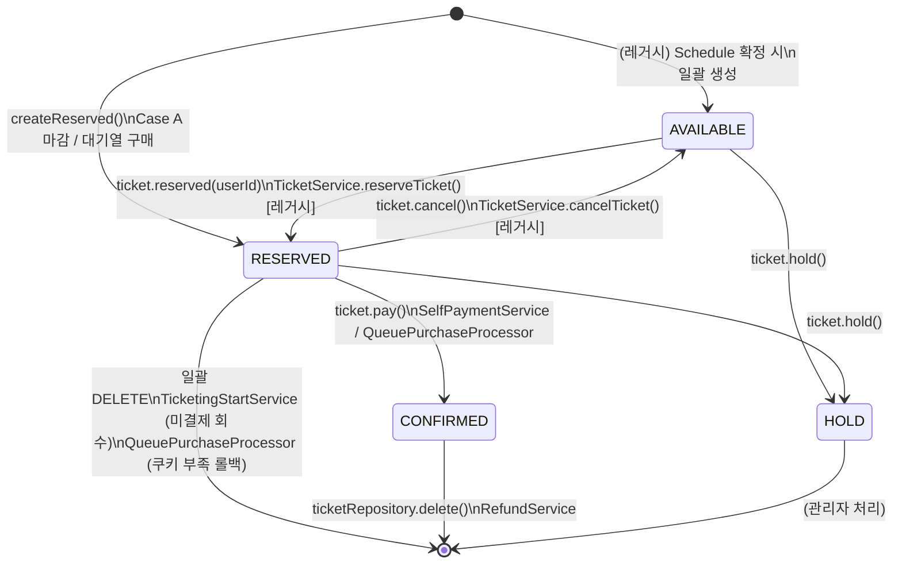

# 티켓 생명주기

## 상태 전이 다이어그램



---

## 상태별 의미

| 상태 | 의미 | 생성 경로 |
|------|------|----------|
| `AVAILABLE` | 예매 가능 (레거시 풀 방식) | 구 플로우: Schedule 확정 시 N개 생성 |
| `RESERVED` | 결제 대기 중 | Case A 마감 / 대기열 구매 시도 / 레거시 예매 |
| `CONFIRMED` | 결제 완료 (확정) | `ticket.pay()` 호출 |
| `HOLD` | 판매 중지 (관리자) | `ticket.hold()` 호출 |

---

## 전이 경로별 상세

### RESERVED 생성 경로

| 경로 | 호출처 | 시점 |
|------|--------|------|
| Case A 가예약 | `CartCloseService` | ticketingTime - 24h |
| 대기열 직접 구매 | `QueuePurchaseProcessor.tryPurchase()` | 유저 enter() 또는 drainQueue() |
| (레거시) 일반 예매 | `TicketService.reserveTicket()` | 유저 요청 즉시 |

### RESERVED → CONFIRMED

| 경로 | 호출처 | 조건 |
|------|--------|------|
| 자율결제 | `SelfPaymentService.pay()` | Case A 유저, 24h 이내 결제 |
| 대기열 구매 완료 | `QueuePurchaseProcessor.tryPurchase()` | 쿠키 차감 성공 |

### RESERVED → 삭제

| 경로 | 호출처 | 조건 |
|------|--------|------|
| 미결제 회수 | `TicketingStartService` | ticketingTime 도달, DB bulk DELETE |
| 구매 실패 롤백 | `QueuePurchaseProcessor.tryPurchase()` | 쿠키 부족, `setRollbackOnly()` |

### CONFIRMED → 삭제

| 경로 | 호출처 | 조건 |
|------|--------|------|
| 환불 | `RefundService.refund()` | 유저 요청, 쿠키 복구 후 DELETE |

---

## 티켓 유니크 제약

```sql
UNIQUE KEY uk_ticket_user_schedule (user_id, schedule_id)
```

유저당 스케줄 1개 티켓만 존재 가능.
RESERVED → 삭제 → 재구매는 가능 (레코드가 삭제되므로 제약 해제).

---

## provideFlag

`CONFIRMED` 티켓에 대해 크리에이터 대금 지급 완료 여부를 추적.

```
false (초기값)
  │ DailyTicketFeeProvideScheduler (매일 오전 1시)
  │ → ticketProvideJob: CONFIRMED + provideFlag=false 티켓 일괄 처리
  │ → Kafka: ticket.provide (settlement-service)
  ▼
true
```