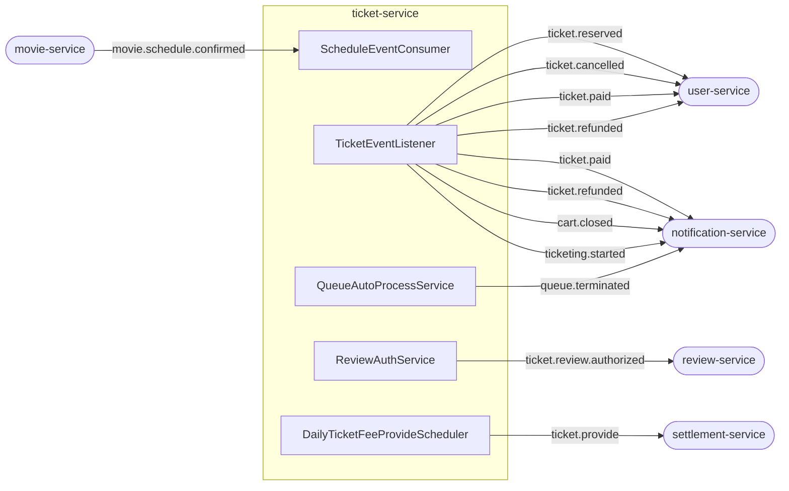

# Kafka 토픽 & 이벤트 레퍼런스

## Consumer (ticket-service가 수신)

### `movie.schedule.confirmed`

| 항목 | 내용 |
|------|------|
| 발행처 | movie-service |
| 소비처 | `ScheduleEventConsumer` |
| Consumer Group | `ticket-group` |
| 트리거 | 영화 스케줄 확정 |

**Payload** (`ScheduleConfirmedMessage`):
```
scheduleId, movieId, title, creatorId,
startTime, endTime, ticketingTime,
cookie, imageUrl, seats
```

**처리 결과:**
- Schedule 엔티티 저장 (status: CART)
- Quartz Job 3개 등록 (AFTER_COMMIT)
- Redis cart count 키 초기화

---

## Producer (ticket-service가 발행)

모든 Kafka 발행은 `@TransactionalEventListener(AFTER_COMMIT)` 이후에만 실행됨.
DB 롤백 시 발행되지 않음.

---

### `ticket.reserved`

| 항목 | 내용 |
|------|------|
| 수신처 | user-service, movie-service |
| 발행 시점 | `TicketService.reserveTicket()` 트랜잭션 커밋 후 |
| 이벤트 클래스 | `TicketReservedEvent` → `TicketReservedMessage` |

```
ticketId, scheduleId, userId, cookieAmount
```

---

### `ticket.cancelled`

| 항목 | 내용 |
|------|------|
| 수신처 | user-service, movie-service |
| 발행 시점 | `TicketService.cancelTicket()` 트랜잭션 커밋 후 |
| 이벤트 클래스 | `TicketCancelledEvent` → `TicketCancelledMessage` |

```
ticketId, scheduleId, userId, cookieAmount
```

---

### `ticket.paid`

| 항목 | 내용 |
|------|------|
| 수신처 | user-service (쿠키 차감 확정), notification-service |
| 발행 시점 | `SelfPaymentService.pay()` 또는 `QueuePurchaseProcessor.tryPurchase()` 커밋 후 |
| 이벤트 클래스 | `TicketPaidEvent` → `TicketPaidMessage` |
| 부가 동작 | `QueueAutoProcessService.checkAndProcess()` 호출 (종료 조건 체크) |

```
ticketId, scheduleId, userId, cookieAmount
```

---

### `ticket.refunded`

| 항목 | 내용 |
|------|------|
| 수신처 | user-service (쿠키 환불 확정), notification-service |
| 발행 시점 | `RefundService.refund()` 트랜잭션 커밋 후 |
| 이벤트 클래스 | `TicketRefundedEvent` → `TicketRefundedMessage` |
| 부가 동작 | Redis stock INCR + `QueueAutoProcessService.checkAndProcess()` |

```
ticketId, scheduleId, userId, cookieAmount
```

---

### `ticket.provide`

| 항목 | 내용 |
|------|------|
| 수신처 | settlement-service |
| 발행 시점 | 매일 오전 1시 (`DailyTicketFeeProvideScheduler`) |
| 발행 방식 | Kafka Bulk (snappy 압축, 배치) |

```
creatorId, ticketId, scheduleId, cookieAmount
```

---

### `ticket.review-auth` (토픽명: `ticket.review.authorized`)

| 항목 | 내용 |
|------|------|
| 수신처 | review-service |
| 발행 시점 | `ReviewAuthQuartzJob` (공연 startTime) |
| 발행 주체 | `ReviewAuthService.publishReviewAuth()` |

```
ticketId, movieId, scheduleId, userId
```

---

### `cart.closed`

| 항목 | 내용 |
|------|------|
| 수신처 | notification-service |
| 발행 시점 | `CartCloseService.execute()` 트랜잭션 커밋 후 |
| 이벤트 클래스 | `CartClosedEvent` → `CartClosedMessage` |

```
scheduleId,
caseType,  // "CASE_A" | "CASE_B"
seats
```

---

### `ticketing.started`

| 항목 | 내용 |
|------|------|
| 수신처 | notification-service |
| 발행 시점 | `TicketingStartService.execute()` 트랜잭션 커밋 후 |
| 이벤트 클래스 | `TicketingStartedEvent` → `TicketingStartedMessage` |

```
scheduleId
```

---

### `queue.terminated`

| 항목 | 내용 |
|------|------|
| 수신처 | notification-service (대기열 대기자 전원 실패 알림) |
| 발행 시점 | `QueueAutoProcessService.terminateQueue()` |
| 중복 방지 | Redis atomic DEL 반환값 true인 스레드만 발행 |

```
scheduleId
```

---

## 전체 토픽 요약

