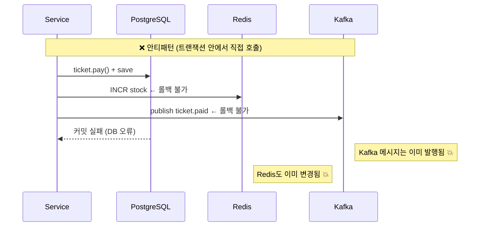
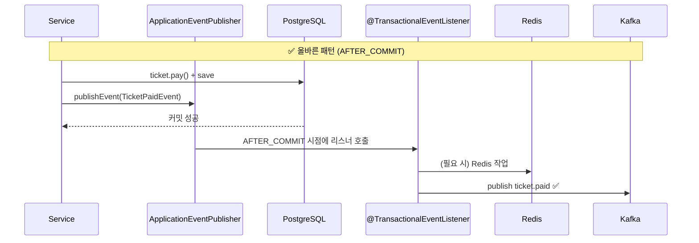

# @TransactionalEventListener 패턴

## 왜 사용하는가

DB 트랜잭션 안에서 Redis·Kafka를 직접 호출하면
트랜잭션이 **롤백될 때 이미 발행된 이벤트/캐시를 되돌릴 수 없다.**





---

## 구현 패턴

### 1. 도메인 이벤트 정의 (`application/event/`)

```java
// 데이터만 담는 불변 레코드
public record TicketPaidEvent(
    Long ticketId, Long scheduleId, UUID userId, Integer cookie) {}
```

### 2. 서비스에서 이벤트 발행

```java
@Transactional
public TicketResponse pay(UUID userId, Long ticketId) {
    // DB 작업
    ticket.pay();
    ticketRepository.save(ticket);

    // 트랜잭션 안에서 발행 — 아직 Kafka/Redis 호출 안 됨
    eventPublisher.publishEvent(
        new TicketPaidEvent(ticketId, scheduleId, userId, cookie));

    return TicketResponse.from(ticket);
}
```

### 3. 리스너에서 Redis/Kafka 처리 (`infrastructure/event/`)

```java
@TransactionalEventListener(phase = TransactionPhase.AFTER_COMMIT)
public void handleTicketPaid(TicketPaidEvent event) {
    // DB 커밋이 보장된 이후에만 실행
    eventPublisherPort.publish("ticket.paid", ..., new TicketPaidMessage(...));
    queueAutoProcessService.checkAndProcess(event.scheduleId());
}
```

---

## 적용된 이벤트 목록

| 이벤트 | 발행처 | 리스너 처리 |
|--------|--------|------------|
| `TicketReservedEvent` | `TicketService` | Kafka `ticket.reserved` |
| `TicketCancelledEvent` | `TicketService` | Kafka `ticket.cancelled` |
| `TicketPaidEvent` | `SelfPaymentService`, `QueuePurchaseProcessor` | Kafka `ticket.paid` + checkAndProcess |
| `TicketRefundedEvent` | `RefundService` | Redis stock INCR + checkAndProcess + Kafka `ticket.refunded` |
| `CartClosedEvent` | `CartCloseService` | Kafka `cart.closed` |
| `TicketingStartedEvent` | `TicketingStartService` | Kafka `ticketing.started` |
| `ScheduleInitializedEvent` | `ScheduleEventConsumer` | Quartz Job 3개 등록 + Redis cart count 초기화 |

---

## 주의사항

### AFTER_COMMIT에서 예외 발생 시

`@TransactionalEventListener(AFTER_COMMIT)` 메서드에서 예외가 발생해도
**이미 커밋된 DB 트랜잭션은 롤백되지 않는다.**
Kafka 발행 실패 시 메시지가 유실될 수 있으므로, 필요 시 별도 재시도/DLQ 전략을 적용해야 한다.

### AFTER_COMMIT vs AFTER_COMPLETION

```java
// AFTER_COMMIT: 커밋 성공 시에만 실행 (권장)
@TransactionalEventListener(phase = TransactionPhase.AFTER_COMMIT)

// AFTER_COMPLETION: 커밋/롤백 모두 실행 (롤백 후 클린업 용도)
@TransactionalEventListener(phase = TransactionPhase.AFTER_COMPLETION)
```

현재 코드베이스는 전부 `AFTER_COMMIT`만 사용.

### @Async와 조합

`QueueAutoProcessService.checkAndProcess()`는 `@Async`라서
리스너가 호출하면 별도 스레드에서 비동기 실행된다.
호출 스레드(리스너)를 블로킹하지 않아 Kafka 발행 성능에 영향을 주지 않는다.

```
handleTicketPaid()
  ├─ eventPublisherPort.publish(...)  ← 동기, 완료 후 리턴
  └─ checkAndProcess()               ← @Async, 즉시 리턴 (별도 스레드에서 실행)
```

### setRollbackOnly()와 AFTER_COMMIT

`QueuePurchaseProcessor.tryPurchase()`에서 쿠키 부족 시
`TransactionAspectSupport.currentTransactionStatus().setRollbackOnly()`를 호출한다.
이 경우 트랜잭션이 롤백되므로 `AFTER_COMMIT` 리스너는 **실행되지 않는다.**
`TicketPaidEvent`는 성공 경로에서만 발행하므로 문제없다.