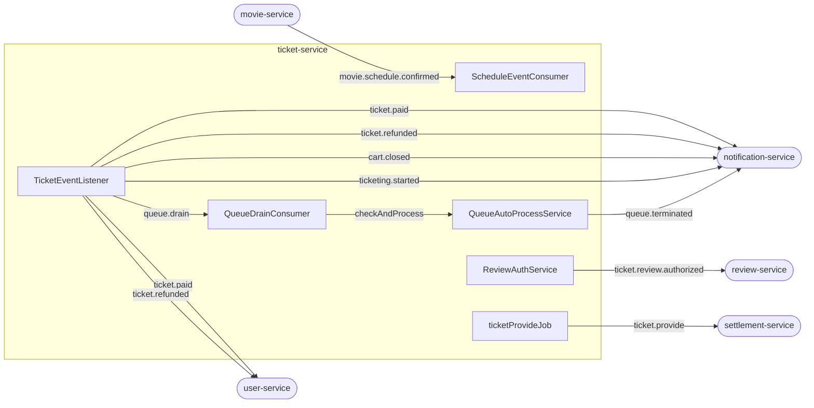

# Kafka 토픽 & 이벤트 레퍼런스

토픽 이름 상수는 `infrastructure/messaging/KafkaTopics.java`에 중앙 관리.

## Consumer (ticket-service가 수신)

### `movie.schedule.confirmed`

| 항목 | 내용 |
|------|------|
| 발행처 | movie-service |
| 소비처 | `ScheduleEventConsumer` |
| Consumer Group | `${spring.kafka.consumer.group-id}` (dev: `ticket-service-dev`) |
| 트리거 | 영화 스케줄 확정 |

**Payload** (`ScheduleConfirmedMessage`):
```
scheduleId, movieId, title, creatorId,
startTime, endTime, ticketingTime,
cookie, imageUrl, seats
```

**처리 결과:**
- Schedule 엔티티 저장 (status: CART)
- Quartz Job 5개 등록 (AFTER_COMMIT): CartClose, TicketingStart, ReviewAuth, StreamingStart, StreamingFinish
- Redis cart count 키 초기화

---

## Producer (ticket-service가 발행)

모든 Kafka 발행은 `@TransactionalEventListener(AFTER_COMMIT)` 이후에만 실행됨.
DB 롤백 시 발행되지 않음.

---

### `ticket.paid`

| 항목 | 내용 |
|------|------|
| 수신처 | user-service (쿠키 차감 확정), notification-service |
| 발행 시점 | `SelfPaymentService.pay()` 또는 `QueuePurchaseProcessor.tryPurchase()` 커밋 후 |
| 이벤트 클래스 | `TicketPaidEvent` → `TicketPaidMessage` |
| 부가 동작 | Kafka `queue.drain` 발행 (드레인 트리거) |

```
ticketId, scheduleId, userId, cookie
```

---

### `ticket.refunded`

| 항목 | 내용 |
|------|------|
| 수신처 | user-service (쿠키 환불 확정), notification-service |
| 발행 시점 | `RefundService.refund()` 트랜잭션 커밋 후 |
| 이벤트 클래스 | `TicketRefundedEvent` → `TicketRefundedMessage` |
| 부가 동작 | ① 쿠키 환불 HTTP 호출 (`UserPort.refundCookie`) ② Redis stock INCR ③ Kafka `queue.drain` 발행 |

> **주의:** 쿠키 환불은 `RefundService` 트랜잭션 내부가 아닌 AFTER_COMMIT 리스너에서 실행된다.
> DB 커밋 성공 후 호출하므로 DB 롤백 시 이중 환불 방지.

```
ticketId, scheduleId, userId, cookie
```

---

### `ticket.provide`

| 항목 | 내용 |
|------|------|
| 수신처 | settlement-service |
| 발행 시점 | 매일 오전 1시 (`ticketProvideJob`, Spring Batch) |
| 발행 방식 | `KafkaBulkEventPublisher` (snappy 압축, 배치) |

```
creatorId, ticketId, scheduleId, cookieAmount
```

---

### `ticket.review.authorized`

| 항목 | 내용 |
|------|------|
| 수신처 | review-service |
| 발행 시점 | `ReviewAuthQuartzJob` (공연 startTime) |
| 발행 주체 | `ReviewAuthService.publishReviewAuth()` |

```
ticketId, movieId, scheduleId, userId
```

---

### `cart.closed`

| 항목 | 내용 |
|------|------|
| 수신처 | notification-service |
| 발행 시점 | `CartCloseService.execute()` 트랜잭션 커밋 후 |
| 이벤트 클래스 | `CartClosedEvent` → `CartClosedMessage` |

```
scheduleId, caseType ("CASE_A" | "CASE_B"), seats, userIds
```

---

### `ticketing.started`

| 항목 | 내용 |
|------|------|
| 수신처 | notification-service |
| 발행 시점 | `TicketingStartService.execute()` 트랜잭션 커밋 후 |
| 이벤트 클래스 | `TicketingStartedEvent` → `TicketingStartedMessage` |
| 부가 동작 | Redis 5개 키 설정 (stock/paying/seats/cookie/startTime) — AFTER_COMMIT 보장 |

> **주의:** Redis 키 설정은 `TicketingStartService` 내부가 아닌 AFTER_COMMIT 리스너에서 실행된다.
> DB 롤백 시 Redis 키가 남아 대기열이 열리는 불일치 방지.

```
scheduleId
```

---

### `queue.drain` (내부 토픽)

| 항목 | 내용 |
|------|------|
| 수신처 | `QueueDrainConsumer` (ticket-service 내부) |
| 발행 시점 | `TicketEventListener.handleTicketPaid()`, `handleTicketRefunded()`, `SelfPaymentService.pay()` (쿠키 부족 경로) |
| Consumer Group | `queue-drain-group` |
| concurrency | 4 (파티션 단위) |
| 키 | `scheduleId` (동일 스케줄의 드레인은 단일 파티션에서 순차 처리) |
| 용도 | `QueueAutoProcessService.checkAndProcess()` 트리거 |

```
scheduleId
```

---

### `queue.terminated` (내부 토픽)

| 항목 | 내용 |
|------|------|
| 수신처 | notification-service (대기열 대기자 전원 실패 알림) |
| 발행 시점 | `QueueAutoProcessService.terminateQueue()` |
| 중복 방지 | Redis atomic DEL 반환값 true인 스레드만 발행 |

```
scheduleId
```

---

## 전체 토픽 요약


