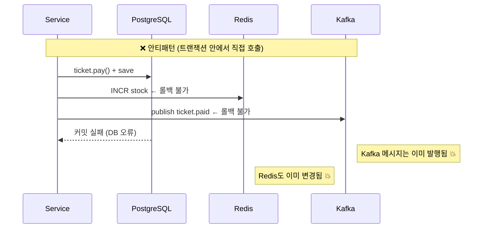
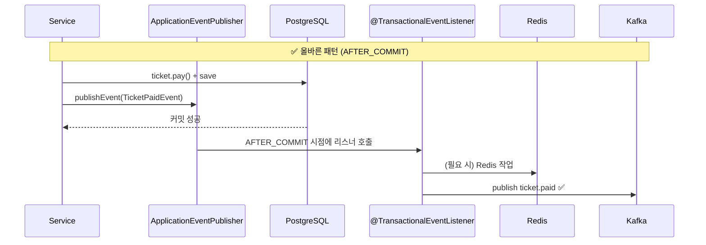

# @TransactionalEventListener 패턴

## 왜 사용하는가

DB 트랜잭션 안에서 Redis·Kafka를 직접 호출하면
트랜잭션이 **롤백될 때 이미 발행된 이벤트/캐시를 되돌릴 수 없다.**





---

## 구현 패턴

### 1. 도메인 이벤트 정의 (`application/event/`)

```java
// 데이터만 담는 불변 레코드
public record TicketPaidEvent(
    Long ticketId, Long scheduleId, UUID userId, Integer cookie) {}
```

### 2. 서비스에서 이벤트 발행

```java
@Transactional
public TicketResponse pay(UUID userId, Long ticketId) {
    // DB 작업
    ticket.pay();
    ticketRepository.save(ticket);

    // 트랜잭션 안에서 발행 — 아직 Kafka/Redis 호출 안 됨
    eventPublisher.publishEvent(
        new TicketPaidEvent(ticketId, scheduleId, userId, cookie));

    return TicketResponse.from(ticket);
}
```

### 3. 리스너에서 Redis/Kafka 처리 (`infrastructure/event/`)

```java
@TransactionalEventListener(phase = TransactionPhase.AFTER_COMMIT)
public void handleTicketPaid(TicketPaidEvent event) {
    // DB 커밋이 보장된 이후에만 실행
    eventPublisherPort.publish("ticket.paid", ..., new TicketPaidMessage(...));
    // 드레인 트리거: Kafka queue.drain 발행 (QueueDrainConsumer가 checkAndProcess 실행)
    eventPublisherPort.publish("queue.drain", scheduleId.toString(), new QueueDrainMessage(scheduleId));
}
```

---

## 적용된 이벤트 목록

| 이벤트 | 발행처 | 리스너 처리 |
|--------|--------|------------|
| `TicketPaidEvent` | `SelfPaymentService`, `QueuePurchaseProcessor` | Kafka `ticket.paid` + Kafka `queue.drain` |
| `TicketRefundedEvent` | `RefundService` | 쿠키 환불 HTTP 호출 + Redis stock INCR + Kafka `queue.drain` + Kafka `ticket.refunded` |
| `CartClosedEvent` | `CartCloseService` | Kafka `cart.closed` |
| `TicketingStartedEvent` | `TicketingStartService` | Redis 5개 키 설정 (stock/paying/seats/cookie/startTime) + Kafka `ticketing.started` |
| `CartUpdatedEvent` | `CartService` | Redis `cart:count:schedule:{id}` INCR 또는 DECR |
| `ScheduleInitializedEvent` | `ScheduleEventConsumer` | Quartz Job 5개 등록 (CartClose, TicketingStart, ReviewAuth, StreamingStart, StreamingFinish) + Redis cart count 초기화 |

---

## 주의사항

### AFTER_COMMIT에서 예외 발생 시

`@TransactionalEventListener(AFTER_COMMIT)` 메서드에서 예외가 발생해도
**이미 커밋된 DB 트랜잭션은 롤백되지 않는다.**
Kafka 발행 실패 시 메시지가 유실될 수 있으므로, 필요 시 별도 재시도/DLQ 전략을 적용해야 한다.

`TicketEventListener.handleTicketRefunded()`는 쿠키 환불, stock 복구, Kafka 발행을 각각 try-catch로 감싸 하나가 실패해도 나머지가 실행되도록 한다.

### AFTER_COMMIT vs AFTER_COMPLETION

```java
// AFTER_COMMIT: 커밋 성공 시에만 실행 (권장)
@TransactionalEventListener(phase = TransactionPhase.AFTER_COMMIT)

// AFTER_COMPLETION: 커밋/롤백 모두 실행 (롤백 후 클린업 용도)
@TransactionalEventListener(phase = TransactionPhase.AFTER_COMPLETION)
```

현재 코드베이스는 전부 `AFTER_COMMIT`만 사용.

### Kafka 기반 드레인 트리거

`checkAndProcess()`는 이전에 `@Async`로 AFTER_COMMIT 리스너에서 직접 호출했으나,
동시 결제 시 스레드 풀(TaskRejectedException) 고갈 문제로 Kafka 기반으로 전환됐다.

현재: AFTER_COMMIT 리스너에서 Kafka `queue.drain` 토픽으로 메시지를 발행하면,
`QueueDrainConsumer` (concurrency=4)가 별도 Kafka consumer 스레드에서 `checkAndProcess()`를 동기 호출한다.
`key=scheduleId` 파티셔닝으로 동일 스케줄의 드레인은 단일 스레드에서 순차 처리된다.

```
handleTicketPaid()
  ├─ eventPublisherPort.publish("ticket.paid", ...)   ← 동기
  └─ eventPublisherPort.publish("queue.drain", ...)   ← 동기 (Kafka fire-and-forget)
                                                          ↓ (별도 Kafka consumer 스레드)
                                                       QueueDrainConsumer.consume()
                                                         └─ checkAndProcess(scheduleId)
```

### CookieCompensationHelper

HTTP로 쿠키를 차감한 후 DB 롤백이 발생하면 쿠키만 차감된 불일치 상태가 된다.
`CookieCompensationHelper.registerRollbackRefund()`가 `TransactionSynchronization.afterCompletion()`을 등록하여,
DB 롤백 시 자동으로 쿠키를 환불한다. `SelfPaymentService`, `QueuePurchaseProcessor`에서 공통 사용.

### setRollbackOnly()와 AFTER_COMMIT

`QueuePurchaseProcessor.tryPurchase()`에서 쿠키 부족 시
`TransactionAspectSupport.currentTransactionStatus().setRollbackOnly()`를 호출한다.
이 경우 트랜잭션이 롤백되므로 `AFTER_COMMIT` 리스너는 **실행되지 않는다.**
`TicketPaidEvent`는 성공 경로에서만 발행하므로 문제없다.
