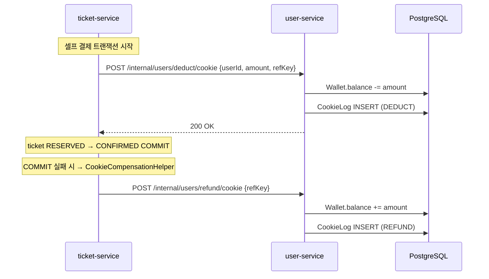

# user-service

> 유저 계정 · 인증 · 쿠키 지갑(Wallet) · OAuth · MinIO 프로필 이미지를 담당
>
> **Maintainer:** [@leeejunu](https://github.com/leeejunu)

CineStream 의 가입자가 만나는 모든 인증·자원 관리의 출발점. 단순한 계정 CRUD 가 아니라, **티켓 결제의 잔액 원천(쿠키 지갑)** 과 **OAuth 로그인**, **MinIO S3 호환 객체 스토리지** 를 묶어 한 서비스에서 처리한다. ticket-service 와는 HTTP 직결로 결제 / 환불을 동기 처리하고, 다른 서비스와는 Kafka 로 비동기 동기화한다. 상위 [루트 README](../README.md) 도 함께 참조.

---

## Responsibilities

- 회원가입 / 로그인 (이메일·비밀번호) · JWT access / refresh 토큰 발급
- Google OAuth 로그인
- 이메일 인증코드 발송 / 검증
- **쿠키 지갑(Wallet) + 사용 로그(CookieLog)** — ticket-service 가 HTTP 로 차감 / 환불 호출
- 좋아요 (Like) — `movie.liked` Kafka 컨슘하여 적재
- MinIO S3 호환 스토리지에 프로필 이미지 업로드
- Kafka publish — `user.created`, `user.updated`, `user.deleted` (다른 서비스 동기화)

---

## Tech Stack


---

## Architecture (Hexagonal)

```
com.example.userservice/
├── domain/
│   ├── model/                    ← User, Wallet, CookieLog, Like, Permission, Role,
│   │                                Gender, DeletedUser
│   └── repository/               ← UserRepository, WalletRepository,
│                                    CookieLogRepository, LikeRepository,
│                                    PermissionRepository, DeletedUserRepository
├── application/
│   ├── usecase/                  ← UserUseCase
│   ├── service/                  ← UserService, GoogleOAuthService, StorageService
│   ├── port/                     ← KafkaPort, RedisPort
│   ├── dto/                      ← GoogleUserInfo
│   └── exception/                ← InsufficientCookie, EmailNotVerified,
│                                    SessionExpired, …
├── infrastructure/
│   ├── persistence/              ← user / wallet / like / cookielog / permission /
│   │                                deleteduser 각각 *JpaRepository + *Adapter
│   ├── kafka/
│   │   ├── KafkaAdapter, KafkaUtil
│   │   ├── UserEventListener     ← AFTER_COMMIT 핸들러
│   │   ├── event/                ← UserCreated, UserUpdated, UserDeleted
│   │   └── consumer/             ← UserPaymentConsumer, UserTicketCancelConsumer,
│   │                                MovieLikedConsumer, MovieDeletedConsumer
│   └── redis/                    ← RedisAdapter (이메일 인증 코드, refresh 토큰)
├── global/
│   ├── config/                   ← MinioConfig, RedisConfig, OpenApiConfig
│   └── util/JwtProvider.java
└── presentation/                 ← UserController, UserInternalController, *Dto
```

---

## 핵심 흐름

### 쿠키 지갑 — 티켓 결제와의 직결



- ticket-service 의 `CookieCompensationHelper` 가 DB 롤백 시 환불 콜백을 등록한다 — HTTP 가 먼저 성공하고 DB 가 롤백되는 격차를 메우는 보상 트랜잭션.
- `CookieLog` 가 모든 잔액 변경 이력을 남겨 사후 검증·운영 조회 가능.

### Kafka 양방향

| Topic | Direction | 용도 |
|---|---|---|
| `user.created` | outbound | 가입 — ai-service 가 유저 취향 프로필 생성 |
| `user.updated` | outbound | 닉네임·이미지 등 변경 |
| `user.deleted` | outbound | 탈퇴 — ai / movie 가 데이터 정리 |
| `payment.confirmed` | inbound | 외부 결제로 쿠키 충전 시 처리 |
| `payment.refunded` | inbound | 외부 결제 환불 |
| `ticket.cancel` | inbound | 티켓 취소 동기화 |
| `movie.liked` | inbound | 좋아요 적재 |
| `movie.deleted` | inbound | 좋아요 정리 |

### MinIO 프로필 이미지

`StorageService` (MinIO 클라이언트) 가 multipart 업로드를 받아 객체 스토리지에 저장하고, 영속화는 `User.profileImageUrl` 만 보관한다. dev 환경은 `local/mnio/docker-compose.yaml` 의 MinIO 컨테이너, prod 는 동일한 S3 호환 URL.

### Google OAuth

`GoogleOAuthService` 가 authorization code 를 받아 ID 토큰을 검증하고, 신규 / 기존 유저를 분기해 자체 JWT 를 발급한다. 클라이언트는 일반 로그인과 동일한 access / refresh 토큰을 사용한다.

---

## API (요약)

| 메서드 | 경로 | 설명 |
|---|---|---|
| `POST` | `/api/users/join` | 회원가입 |
| `POST` | `/api/users/login` | 이메일·비밀번호 로그인 |
| `POST` | `/api/auth/refresh` | refresh 토큰으로 access 재발급 |
| `POST` | `/api/oauth2/google` | Google OAuth 로그인 |
| `POST` | `/api/users/email/send` `verify` | 이메일 인증 코드 |
| `GET` `PATCH` | `/api/users/me` | 프로필 조회·수정 |
| `POST` | `/internal/users/deduct/cookie` | (internal) 쿠키 차감 |
| `POST` | `/internal/users/refund/cookie` | (internal) 쿠키 환불 |
| `GET` | `/api/users/me/cookie-logs` | 사용 로그 조회 |

자세한 스펙은 Swagger UI `http://localhost:8085/swagger-ui.html`.

---

## Dependencies

| 종류 | 대상 |
|---|---|
| HTTP inbound (internal) | ticket-service — `/internal/users/deduct/cookie`, `/internal/users/refund/cookie` |
| Kafka outbound | `user.created`, `user.updated`, `user.deleted` |
| Kafka inbound | `payment.confirmed`, `payment.refunded`, `ticket.cancel`, `movie.liked`, `movie.deleted` |
| External | Google OAuth, MinIO (S3 호환), SMTP (이메일 인증) |
| Infra | PostgreSQL `user_db`, Redis 7 (이메일 코드 / refresh 토큰), Kafka |

---

## Run

```bash
./gradlew bootRun                     # dev profile, port 8085
SPRING_PROFILES_ACTIVE=prod ./gradlew bootRun
./gradlew test
```

MinIO 가 `local/mnio/docker-compose.yaml` 으로 떠 있어야 프로필 이미지 업로드 시나리오가 동작한다.

주요 prod 환경변수: `DB_HOST`, `REDIS_HOST`, `KAFKA_BOOTSTRAP_SERVERS`, `MINIO_URL`, `MINIO_ACCESS_KEY`, `MINIO_SECRET_KEY`, `MINIO_BUCKET`, `GOOGLE_CLIENT_ID`, `GOOGLE_CLIENT_SECRET`, `GOOGLE_REDIRECT_URI`, `MAIL_HOST`, `MAIL_USERNAME`, `MAIL_PASSWORD`, `JWT_PRIVATE_KEY`, `JWT_PUBLIC_KEY`.

---

## 추가 자료

- 환경변수 — [docs/env-guide.md](../docs/env-guide.md)
- 배포 — [docs/DEPLOYMENT.md](../docs/DEPLOYMENT.md)